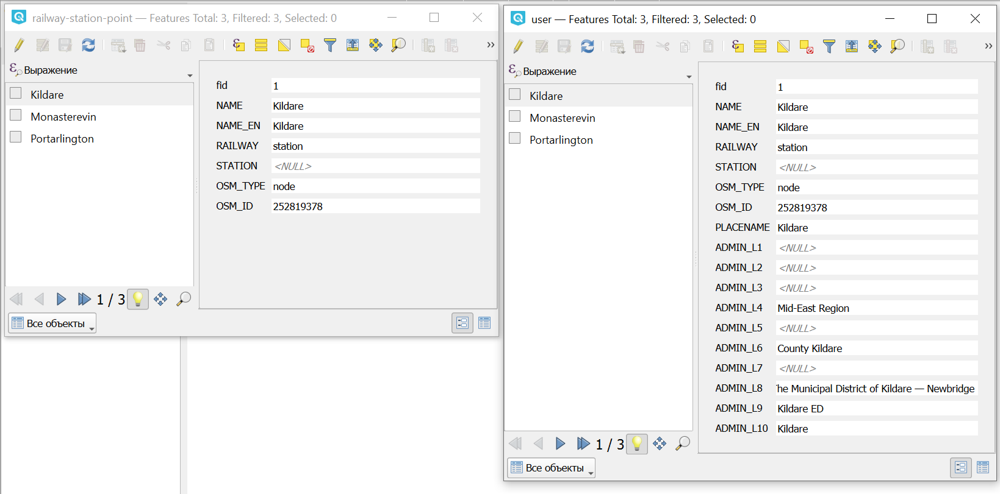

Добавление названий АТД и НП в атрибуты
=======================================

Добавляет к объектам любого векторного слоя атрибуты с названиями единиц административно-территориального деления и населённых пунктов. В качестве источника данных используется выгрузка с data.nextgis.com.

На входе:

* Векторный слой в формате GeoPackage, GeoJSON или ESRI Shapefile в ZIP-архиве;
* Выгрузка data.nextgis.com. ZIP-архив с данными в формате GeoPackage;
* Название выходного файла (не обязательно). 

На выходе:

* Файл GeoPackage с изменёнными векторными данными;
* Файл CSV с теми же данными.

Запуск инструмента: https://toolbox.nextgis.com/t/add_regions

   Исходные данные и данные с атрибутами, добавленными инструментом

**Попробуйте инструмент в действии**

1. Нажмите кнопку **Демо** над формой инструмента. Поля будут автоматически заполнены демонстрационными значениями.
2. Нажмите кнопку **Запустить**.

.. seealso::

   * `Генерирует карту в Веб ГИС по таблице со списком кодов регионов ОКАТО и вашим числовым значениям <https://toolbox.nextgis.com/t/infomap?from-related-tools=1>`_
   * `Объединение OSM и РеформаЖКХ файлами <https://toolbox.nextgis.com/t/joinreforma?from-related-tools=1>`_

