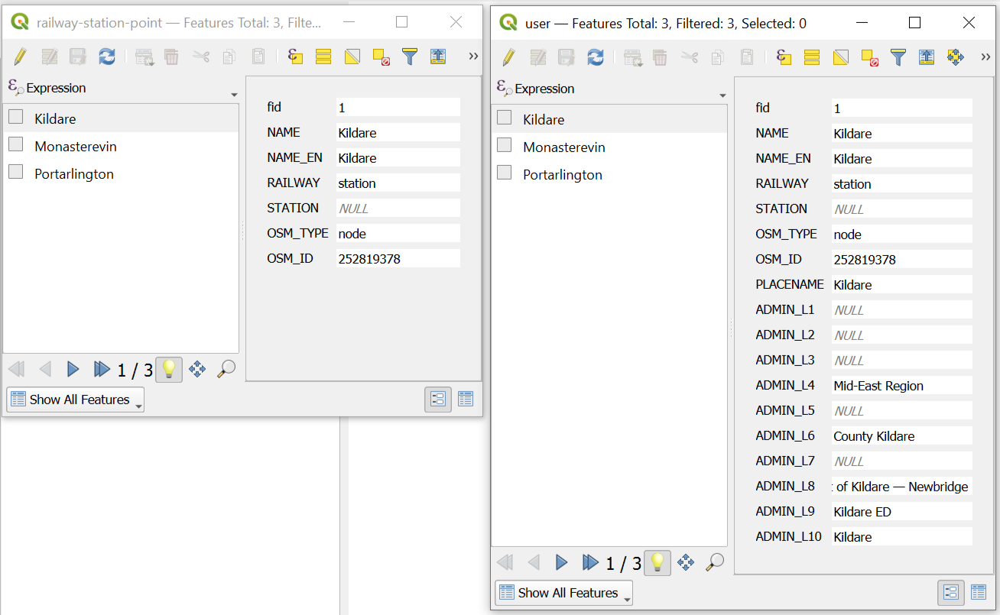

Add region and settlement names to attributes
=============================================

Appends attributes with administrative division and settlement names to any vector layer features. Uses data.nextgis.com extract as input source of region and settlement names.

Inputs:

* Vector file - Geopackage, GeoJSON file or zipped ESRI Shapefile;
* Zip file with data extract from data.nextgis.com; 
* Output name (optional).

Outputs:

* GeoPackage file containing data with added attributes;
* CSV file with the same data.

Launch the tool: https://toolbox.nextgis.com/t/add_regions

   Initial data and the same data with added attributes

**Try the tool in action**

1. Click on the **Demo** button above the tool form. The fields are filled in with demo values.
2. Click on the **Run** button.
