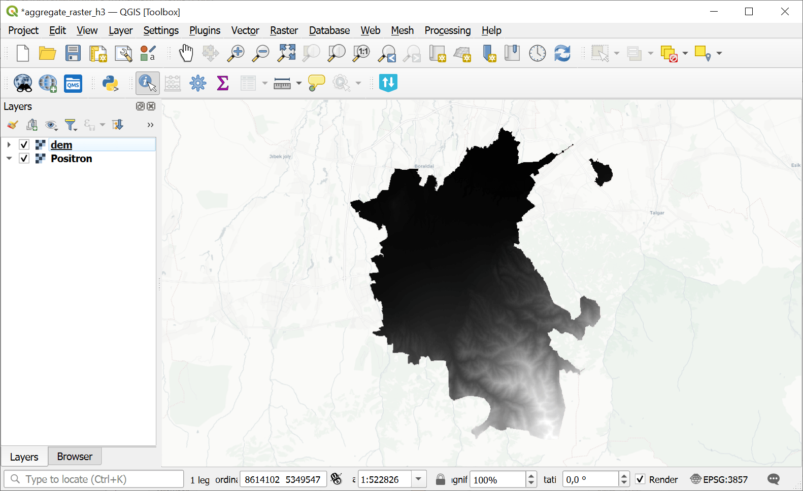
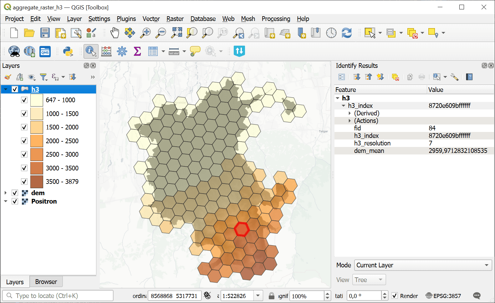

Aggregate raster layer to H3 grid
=================================

Creates an H3 grid covering the raster layer extent and aggregates raster values into its cells.

Inputs:

* Input raster layer. GDAL-compatible raster dataset;
* Minimal H3 Zoom (H3 zoom levels are valid in range 0-15);
* Maximal H3 Zoom (H3 zoom levels are valid in range 0-15);
* Band number - raster band to aggregate values from (leave empty to use band 1);
* Pixel spatial handling mode:

  - PIXEL_CENTER (PIXEL_CENTER) - include pixels whose centers fall inside the H3 cell;
  - INTERSECTS (INTERSECTS) - include every pixel touched by the H3 cell;

* Aggregation method. How to statistically aggregate values:

  - Create grid only (EMPTY)
  - Count (COUNT)
  - Sum (SUM)
  - Mean (MEAN)
  - Median (MEDIAN)
  - Min (MIN)
  - Max (MAX)
  - Mode (MODE)

* Output field name;
* Split zoom levels. If checked, each H3 zoom level cells will be saved in separate layer.

Outputs:

* None

Launch the tool: https://toolbox.nextgis.com/t/aggregate_raster_layer_to_h3

Example:

   Example input raster layer: DEM

   Example output H3 grid

**Try the tool in action**

1. Click on the **Demo** button above the tool form. The fields are filled in with demo values.
2. Click on the **Run** button.

.. admonition:: Related tools

   * `Aggregate vector layer to H3 grid <https://toolbox.nextgis.com/t/aggregate_vector_layer_to_h3?from-related-tools=1>`_
   * `Search & download Planetary Computer <https://toolbox.nextgis.com/t/planetary_search?from-related-tools=1>`_
   * `Vector layers from an archive to Web GIS <https://toolbox.nextgis.com/t/layers2ngw?from-related-tools=1>`_