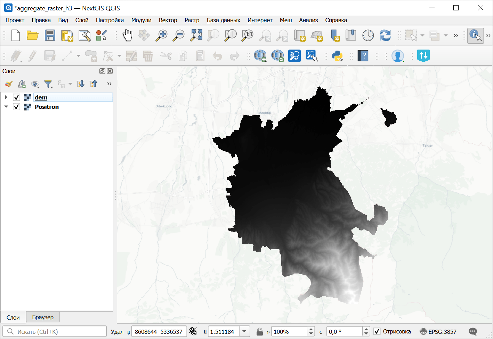
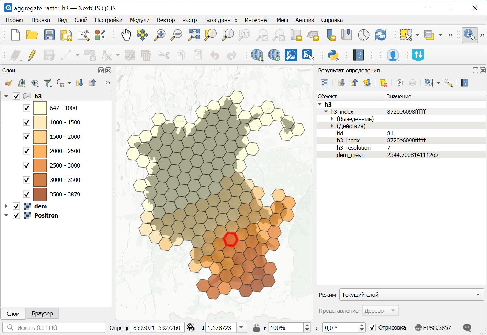

Агрегирование растрового слоя на сетку H3
=========================================

Создаёт сетку H3, охватывающую область растрового слоя, и агрегирует значения растрового слоя в ячейках этой сетки.

На входе:

* Входной растровый слой - GDAL-совместимый растровый набор данных;
* Начальный масштабный уровень H3 (Масштабные уровни H3 действительно в диапазоне 0-15);
* Конечный масштабный уровень H3 (Масштабные уровни H3 действительно в диапазоне 0-15);
* Номер канала, откуда брать данные для агрегации (оставьте пустым чтобы использовать канал 1);
* Режим пространственного учёта пикселй:

  - PIXEL_CENTER (PIXEL_CENTER) - учитывать пиксели, центры которых находятся внутри ячейки H3;
  - INTERSECTS (INTERSECTS) - учитывать все пиксели, с которыми пересекается ячейка H3;

* Метод агрегации. Как статистически обобщать данные:

  - Создать сетку без агрегации (EMPTY)
  - Количество пикселей (COUNT)
  - Сумма (SUM)
  - Среднее (MEAN)
  - Медиана (MEDIAN)
  - Минимум (MIN)
  - Максимум (MAX)
  - Мода (MODE)

* Имя результирующего поля;
* Разбить по масташбным уровням. Если активно, набор данных будет разбит по слоям на каждый масштабный уровень H3.

На выходе:

* GeoPackage с сеткой H3.

Запуск инструмента: https://toolbox.nextgis.com/t/aggregate_raster_layer_to_h3

Пример работы инструмента:

   Пример исходных данных: ЦМР

   Пример результата работы инструмента: сетка H#

**Попробуйте инструмент в действии:**

1. Нажмите кнопку **Демо** над формой инструмента. Поля будут автоматически заполнены демонстрационными значениями.
2. Нажмите кнопку **Запустить**.

.. seealso::

   * `Агрегирование векторного слоя на сетку H3 <https://toolbox.nextgis.com/t/aggregate_vector_layer_to_h3?from-related-tools=1>`_
   * `Скачивание данных Planetary Computer <https://toolbox.nextgis.com/t/planetary_search?from-related-tools=1>`_
   * `Векторные слои из архива в Веб ГИС <https://toolbox.nextgis.com/t/layers2ngw?from-related-tools=1>`_