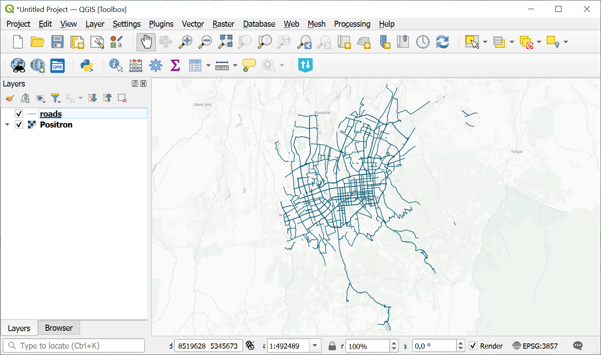
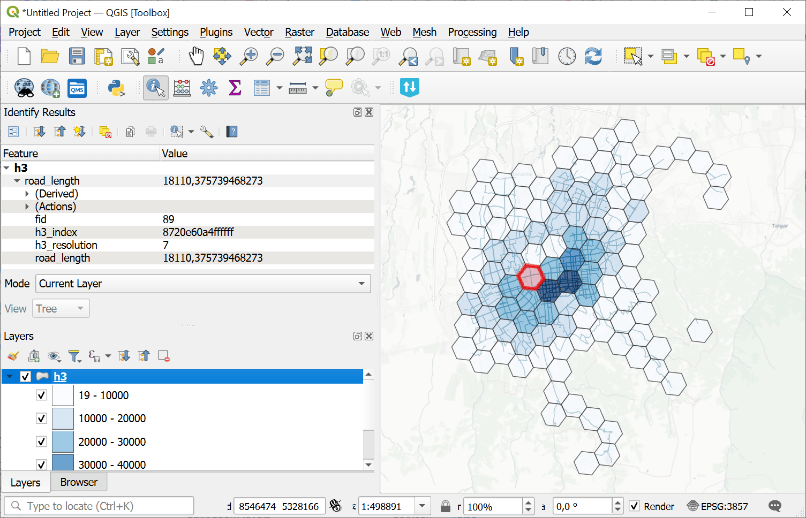

Aggregate vector layer to H3 grid
=================================

Creates an H3 grid covering the vector layer extent and aggregates vector features and attribute values into its cells.

Inputs:

* Input vector layer. GDAL-compatible vector dataset;
* Minimal H3 Zoom (H3 zoom levels are valid in range 0-15);
* Maximal H3 Zoom (H3 zoom levels are valid in range 0-15);
* Aggregation attribute - numeric attribute used for aggregation. Not required for grid creation, feature count or geometry sum;
* Feature spatial handling mode, select one from the list:

  - Fully inside (FULLY_INSIDE) - include only features completely inside an H3 cell.
  - Intersects (INTERSECTS) - include every feature intersecting an H3 cell.
  - Split by H3 grid (SPLIT) - split line or polygon features by the H3 grid and distribute attribute values proportionally to fragment length or area where applicable;

* Aggregation method. How to aggregate vector features or attribute values:
  - Create grid only (EMPTY)
  - Count features (COUNT)
  - Sum length or area (GEOMETRY_SUM)
  - Sum (SUM)
  - Mean (MEAN)
  - Median (MEDIAN)
  - Min (MIN)
  - Max (MAX)

* Output field name - name of the output aggregation field. If empty, ``aggregated_value`` is used;
* Split zoom levels - if checked, cells of each H3 zoom level will be saved to a separate layer.

Outputs:

* GeoPackage containing H3 grid.

Launch the tool: https://toolbox.nextgis.com/t/aggregate_vector_layer_to_h3

Example:

   Example input vector layer

   Example output H3 grid

**Try the tool in action**

1. Click on the **Demo** button above the tool form. The fields are filled in with demo values.
2. Click on the **Run** button.

.. admonition:: Related tools

  * `Aggregate raster layer to H3 grid <https://toolbox.nextgis.com/t/aggregate_raster_layer_to_h3?from-related-tools=1>`_
  * `Vector layers from an archive to Web GIS <https://toolbox.nextgis.com/t/layers2ngw?from-related-tools=1>`_