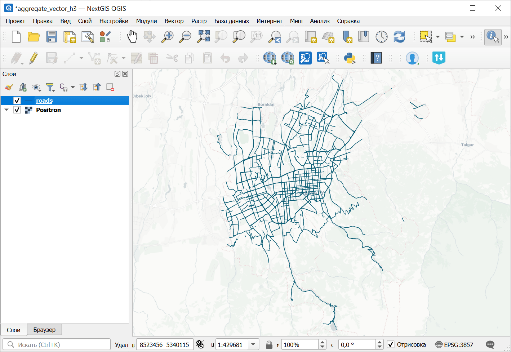
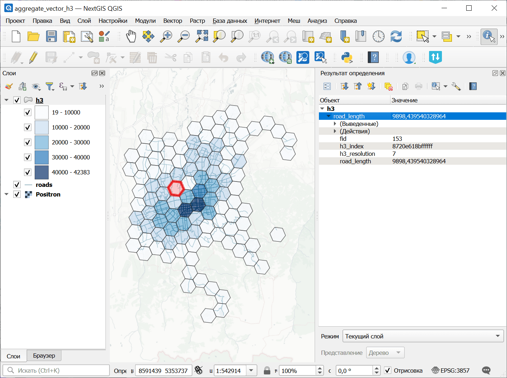

Агрегирование векторного слоя на сетку H3
=========================================

Создаёт сетку H3, охватывающую область векторного слоя, и агрегирует пространственные объекты и значения их атрибутов в ячейках этой сетки.

На входе:

* Входной векторный слой - GDAL-совместимый векторный набор данных;
* Начальный масштабный уровень H3 (Масштабные уровни H3 допустимы в диапазоне 0-15);
* Конечный масштабный уровень H3 (Масштабные уровни H3 допустимы в диапазоне 0-15);
* Поле для агрегации - числовое поле, используемое для расчёта. Не требуется для создания сетки, подсчёта объектов и суммирования длин или площадей;
* Режим пространственного учёта объектов:

  - Полностью внутри (FULLY_INSIDE)Учитывать только объекты, полностью находящиеся внутри ячейки H3;
  - Пересекается (INTERSECTS)Учитывать все объекты, пересекающиеся с ячейкой H3;
  - Разбить по сетке H3 (SPLIT)Разбить линейные или полигональные объекты по сетке H3 и, где применимо, распределить значения атрибутов пропорционально длине или площади фрагментов;

* Метод агрегации. Как агрегировать пространственные объекты или значения атрибутов:

  - Создать сетку без агрегации (EMPTY)
  - Количество объектов (COUNT)
  - Сумма длин или площадей (GEOMETRY_SUM)
  - Сумма (SUM)
  - Среднее (MEAN)
  - Медиана (MEDIAN)
  - Минимум (MIN)
  - Максимум (MAX)

* Имя результирующего поля - имя результирующего поля с агрегированным значением. Если не указано, используется aggregated_value;
* Разбить по масштабным уровням - если активно, ячейки каждого масштабного уровня H3 будут сохранены в отдельном слое.

На выходе:

* GeoPackage с сеткой H3.

Запуск инструмента: https://toolbox.nextgis.com/t/aggregate_vector_layer_to_h3

Пример работы инструмента:

   Пример исходных данных: дорожная сеть

   Пример результата работы инструмента: сетка H3

**Попробуйте инструмент в действии:**

1. Нажмите кнопку **Демо** над формой инструмента. Поля будут автоматически заполнены демонстрационными значениями.
2. Нажмите кнопку **Запустить**.

.. seealso::

   * `Агрегирование растрового слоя на сетку H3 <https://toolbox.nextgis.com/t/aggregate_raster_layer_to_h3?from-related-tools=1>`_
   * `Векторные слои из архива в Веб ГИС <https://toolbox.nextgis.com/t/layers2ngw?from-related-tools=1>`_