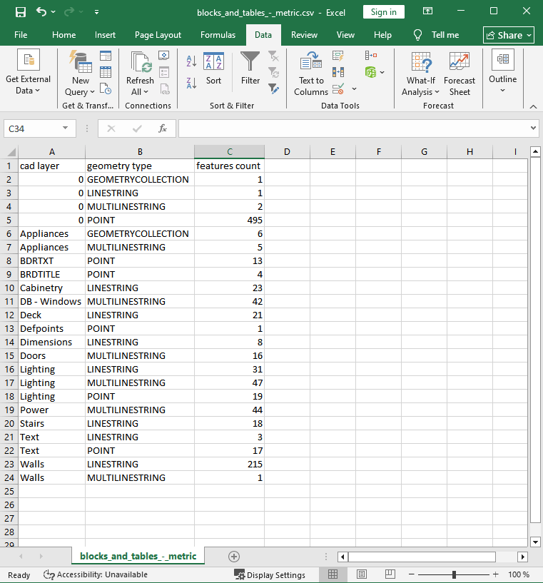

Layer list from DWG / DXF file
==================================

This tool generates a CSV containing the list of layers from a DWG or DXF file with information on geometry and feature count.

Inputs:

* Source file in AutoCAD DWG / DXF formats

Outputs:

* CSV with layer list

Launch the tool: https://toolbox.nextgis.com/t/autocad_file_schema

Example:

.. figure:: _static/import_dwg_oda_input_en.png
   :name: autocad_file_schema_input_pic
   :align: center
   :width: 22cm

   Example input

   Example output: list of layers

**Try the tool in action**

1. Click on the **Demo** button above the tool form. The fields are filled in with demo values.
2. Click on the **Run** button.

.. admonition:: Related tools

   * `DWG to DXF <https://toolbox.nextgis.com/t/import_dwg?from-related-tools=1>`_
   * `DWG to DXF (ODA) <https://toolbox.nextgis.com/t/import_dwg_oda?from-related-tools=1>`_