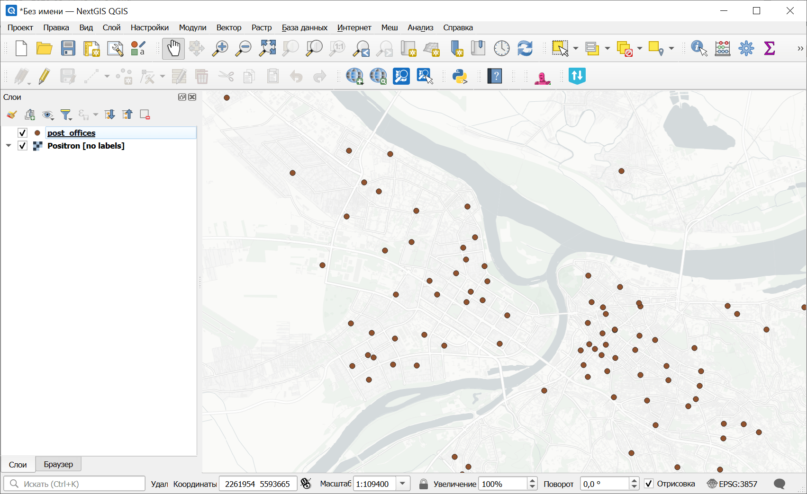
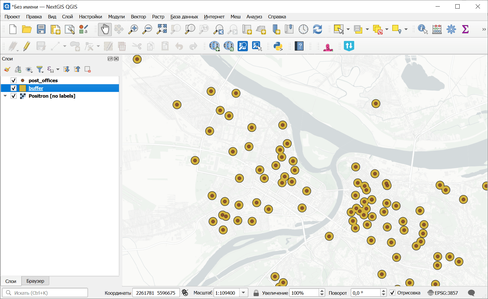

Буферные зоны
=============

Создаёт буферные зоны для всех объектов входного слоя с использованием фиксированного значения или значения атрибута.

На входе:

* Исходный файл. Единичный файл или ZIP с любым совместимым с OGR векторным набором данных;
* Источник размера буферной зоны. Откуда брать значение размера буферной зоны:

  - Значение (Value);
  - Атрибут (Attribute);

* Размер буферной зоны. Указывается, если в качестве источника выбрано Значение;
* Название атрибута - числовой атрибут, содержащий размеры буферных зон, если в качестве источника выбран Атрибут;
* СК для расчёта - система координат, используемая для построения буферов:

  - Внутренняя система координат исходного слоя (Internal);
  - Оптимальная зона UTM (UTM);

* Количество сегментов - количество отрезков для аппроксимации четверти окружности при создании скруглённых буферов;
* Объединять пересекающиеся буферные зоны. Несвязанные части результата записываются как отдельные объекты.
* Выходной формат результирующего набора данных:

  - GeoPackage (GPKG);
  - GeoJSON (GeoJSON);

* Выходная СК. Система координат результирующего файла:

  - Внутренняя система координат исходного слоя (Internal);
  - WGS84 (EPSG:4326) (WGS84);
  - Pseudo Mercator (EPSG:3857) (Pseudo Mercator);
  - Оптимальная зона UTM (UTM).

На выходе:

* Файл GeoPackage.

Запуск инструмента: https://toolbox.nextgis.com/t/buffer

Пример работы инструмента:

   Исходные точечные данные

   Буферные зоны, построенные вокруг точек

**Попробуйте инструмент в действии:**

1. Нажмите кнопку **Демо** над формой инструмента. Поля будут автоматически заполнены демонстрационными значениями.
2. Нажмите кнопку **Запустить**.

.. seealso::

   * `Пересечение полигонов <https://toolbox.nextgis.com/t/vectorclip?from-related-tools=1>`_
   * `Координаты точки в полигоне <https://toolbox.nextgis.com/t/centroid2attr?from-related-tools=1>`_
   * `Поиск по кадастровым номерам <https://toolbox.nextgis.com/t/cadnums_to_geodata?from-related-tools=1>`_
   * `Каталог координат в геоданные <https://toolbox.nextgis.com/t/coords2poly?from-related-tools=1>`_