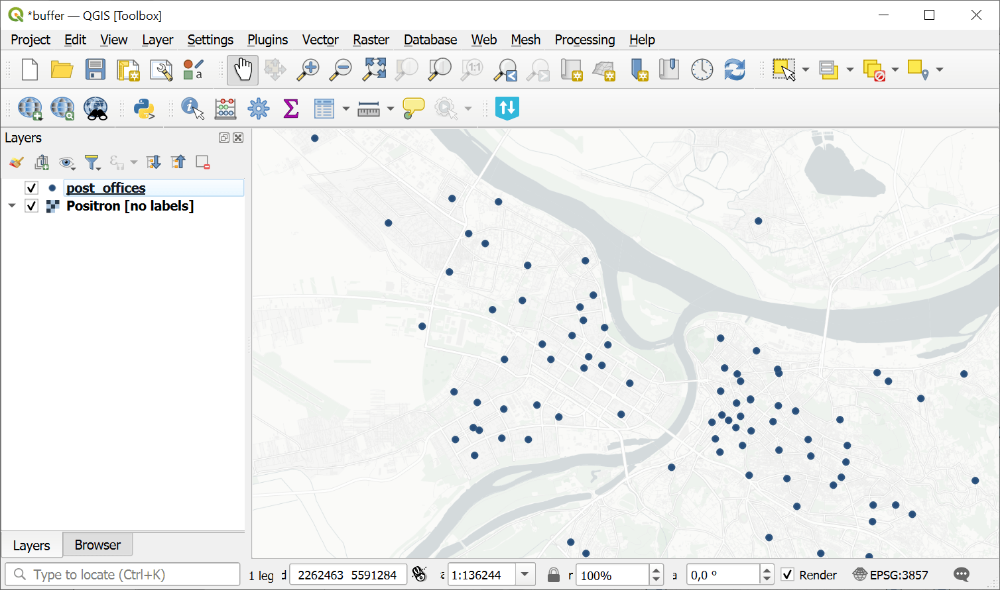
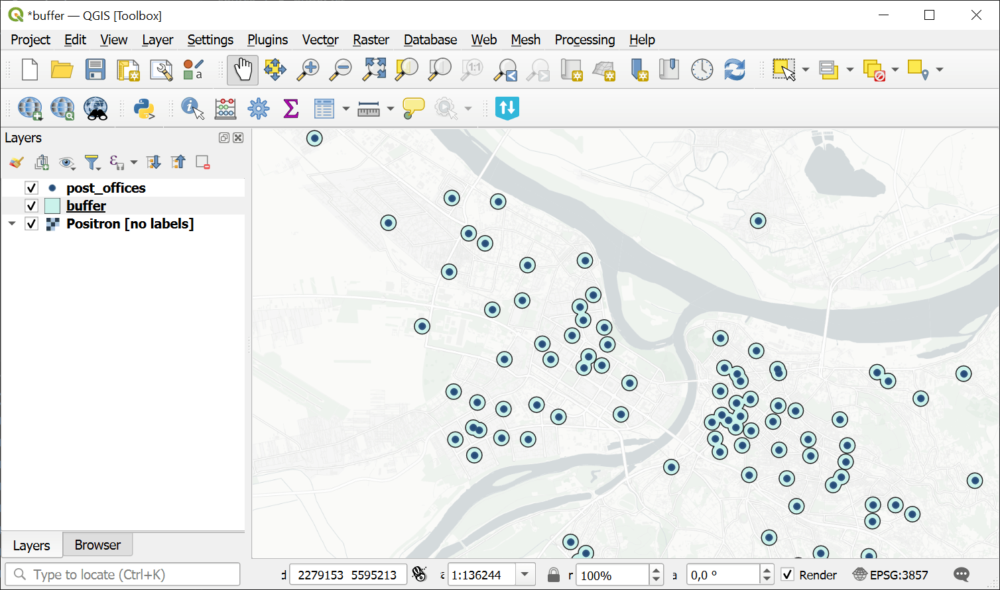

Buffer
======

Computes buffer areas for all features in an input layer using a fixed or attribute-based distance.

Inputs:

* Source file. Single file or ZIP with any OGR-compatible vector dataset.
* Buffer distance source. Where to take the buffer distance from:

  - Value;
  - Attribute;

* Buffer distance - buffer distance when Value is selected;
* Attribute name - numeric attribute containing buffer distances if Attribute is selected;
* Calculation CRS - coordinate reference system used for buffering:

  - Source layer internal CRS (Internal);
  - Optimal UTM Zone (UTM);

* Segments - number of segments used to approximate a quarter circle in rounded buffers;
* Merge overlaps - dissolve overlapping buffers. Disconnected dissolved parts are written as separate features;
* Output format - format of the output buffer dataset:

  - GeoPackage (GPKG);
  - GeoJSON (GeoJSON);

* Output CRS - coordinate reference system of the output file:

  - Source layer internal CRS (Internal);
  - WGS84 (EPSG:4326) (WGS84);
  - Pseudo Mercator (EPSG:3857) (Pseudo Mercator);
  - Optimal UTM Zone (UTM).

Outputs:

* GeoPackage file.

Launch the tool: https://toolbox.nextgis.com/t/buffer

Example:

   Source point layer

   Buffer zones created around the points

**Try the tool in action**

1. Click on the **Demo** button above the tool form. The fields are filled in with demo values.
2. Click on the **Run** button.
