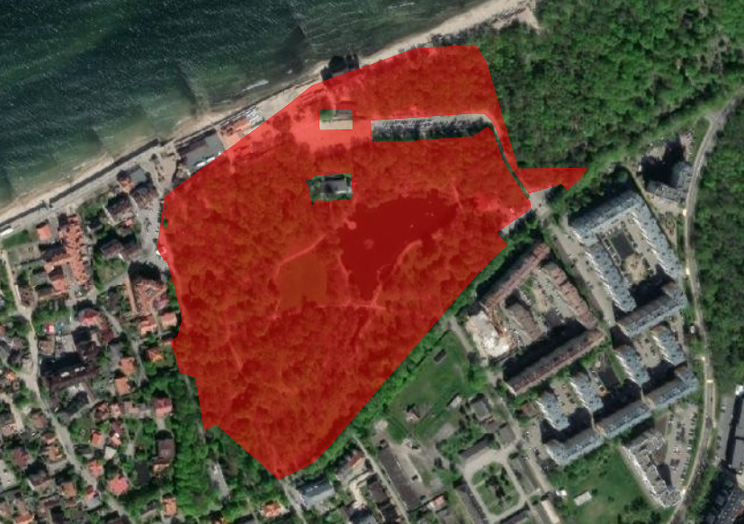

Генерация изображения кадастрового участка по номеру
========================================================

Генерация изображения кадастрового участка по номеру с карты nspd.gov.ru.

На входе:

* Кадастровый номер в формате ``06:07:0400001:414`` или ``06:07:0400001``.
* Тип объекта - задайте номер типа. Доступны следующие типы объектов: 1 - Земельные участки, 2 - Кадастровые кварталы, 4 - Кадастровые округа, 5 - объекты капитального строительства, 10 - Зоны с особыми условиями использования территорий (ЗОУИТ)
* Ширина изображения - ширина выходного изображения в пикселях (по умолчанию: 827)
* Высота изображения - Высота выходного изображения в пикселях (по умолчанию: 583)
* Цвет заливки объекта. Допустимые значения — названия HTML-цветов или HEX-формат (например, ``orange``, ``#FFA500``). По умолчанию: ``red`` (красный).
* Прозрачность заливки объекта - от 0 (полностью прозрачный) до 1 (непрозрачный) с точкой в качестве десятичного разделителя, значение по умолчанию: 0.6.
* Цвет обводки объекта. Если не задан, используется цвет заливки. Допустимые значения — названия HTML-цветов или HEX-формат (например, ``orange``, ``#FFA500``).
* Прозрачность обводки - от 0 (полностью прозрачный) до 1 (непрозрачный) с точкой в качестве десятичного разделителя, значение по умолчанию: 1.
* QMS ID - Идентификатор подложки из каталога NextGIS QMS (QuickMapServices - https://qms.nextgis.com). Если не задан, по умолчанию в качестве подложки используется OpenStreetMap. Примеры: ``1300`` – Спутниковые снимки, ``519`` – Топографическая карта.
* Максимальный уровень приближения при автоцентровке слоя (по умолчанию: 18). Допустимый диапазон: от 0 (вид на весь мир) до 22 (детализация на уровне зданий).
* Отступ вокруг слоя при автоцентровке, задаётся в пикселях (по умолчанию: 5).

На выходе:

* Изображение в формате PNG.

Запуск инструмента: https://toolbox.nextgis.com/t/cadastre2img

   Пример полученного изображения

**Попробуйте инструмент в действии, скачав наш пример:**

`Набор исходных данных <https://nextgis.ru/data/toolbox/cadastre2img/cadastre2img_inputs_ru.zip>`_ для проверки работы инструмента. Внутри архива пошаговая инструкция.

`Пример результата <https://nextgis.ru/data/toolbox/cadastre2img/cadastre2img_outputs_ru.zip>`_ работы инструмента.
