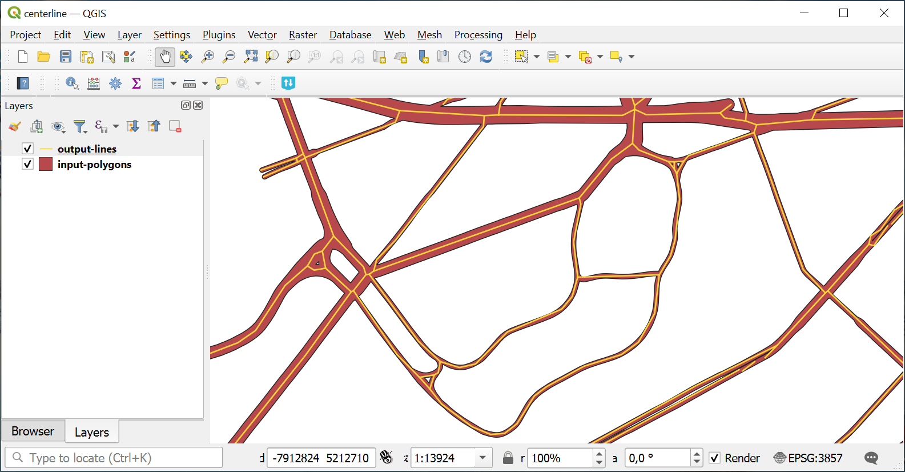

Central lines of polygons
============================

This instrument creates centerlines for polygons. It is helpful for transforming roads or rivers digitized as polygons into lines.

   Input polygon layer and resulting line layer

Inputs:

* Polygon vector layer in a GDAL-supported format, e.g. GeoPackage, GeoJSON, MapInfo TAB, ESRI Shapefile (the latter two should be in ZIP archive).

Outputs:

* Line vector layer in GeoPackage.

Launch the tool: https://toolbox.nextgis.com/t/centerline

**Try it out using our sample:**

Download `input dataset <https://nextgis.com/data/toolbox/centerline/centerline_inputs.zip>`_ to test the instrument. Step-by-step instructions included.

Get the `output <https://nextgis.com/data/toolbox/centerline/centerline_outputs.zip>`_ to additionally check the results.
