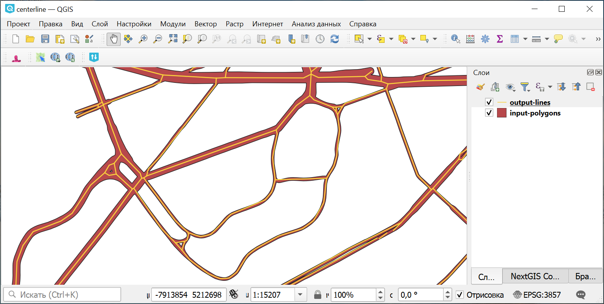

Центральные линии полигонов
============================

Инструмент предназначен для построения центральных (осевых) линий для полигонов. Например, может использоваться для превращения полигональных дорог в линейные.

   Исходный полигональный слой и полученный из него линейный слой

На входе:

* Полигональный векторный слой в поддерживаемом GDAL формате, например, GeoPackage, GeoJSON, MapInfo TAB, ESRI Shapefile (последние два - в ZIP-архиве).

На выходе:

* Линейный векторный слой в формате GeoPackage.

Запуск инструмента: https://toolbox.nextgis.com/t/centerline

**Попробуйте инструмент в действии, скачав наш пример:**

`Набор исходных данных <https://nextgis.ru/data/toolbox/centerline/centerline_inputs_ru.zip>`_ для проверки работы инструмента. Внутри архива пошаговая инструкция.

`Пример результата <https://nextgis.ru/data/toolbox/centerline/centerline_outputs_ru.zip>`_ работы инструмента.
