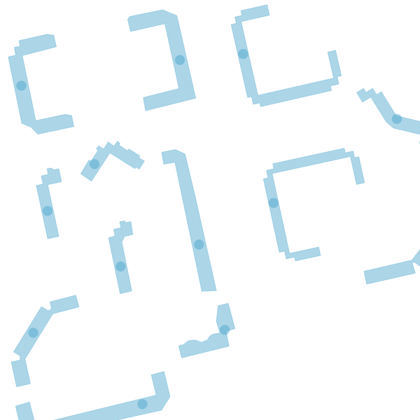
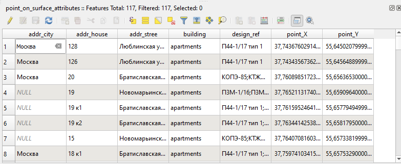

Координаты точки в полигоне
============================

Расчет координат точки гарантировано находящейся внутри полигона и добавление этих координат в атрибуты point_X, point_Y. Метод PointOnSurface. Работает только с полигонами.

На входе:

* Полигональный слой - векторный слой в одном из поддерживаемых GDAL форматов, например, Shapefile в ZIP-архиве, GeoJSON, GeoPackage.

На выходе:

* ZIP-архив с shp-файлом слоя полигонов, содержащим два новых поля point_X, point_Y 

   Визуализация центроидов, используемых для вычисления координат
   

   Таблица объектов слоя, полученная с помощью инструмента
   

Запуск инструмента: https://toolbox.nextgis.com/t/centroid2attr

**Попробуйте инструмент в действии**

1. Нажмите кнопку **Демо** над формой инструмента. Поля будут автоматически заполнены демонстрационными значениями.
2. Нажмите кнопку **Запустить**.

.. seealso::

   * `Центральные линии полигонов <https://toolbox.nextgis.com/t/centerline?from-related-tools=1>`_

