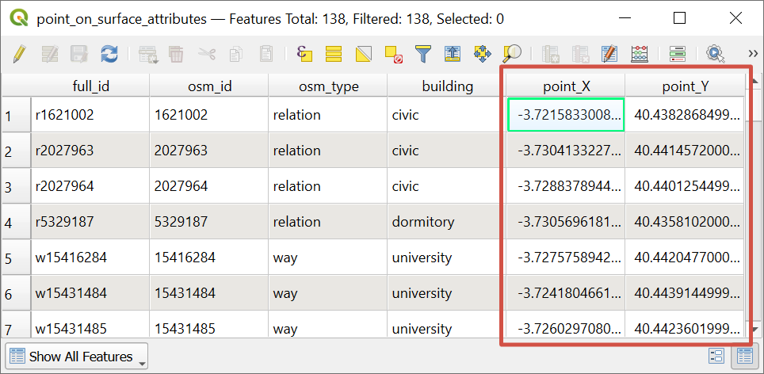

Point inside polygon coordinates
================================

Calculate coorinates of a point guaranteed to be inside a polygon and add the calculated coordinates to point_X, point_Y attributes. PointOnSurface method.

Inputs:

* Polygon vector layer in one of the formats, supported by GDAL, e.g. Shapefile in ZIP-archive, GeoJSON, GeoPackage.

Outputs:

* ZIP with polygonal shapefile with two fields added: point_X, point_Y 

.. figure:: _static/point_on_surface.png
   :align: center
   :width: 16cm
   
   Visualization of the calculated centroids 

   Resulting feature table of the layer with added attributes

Launch the tool: https://toolbox.nextgis.com/t/centroid2attr

**Try the tool in action**

1. Click on the **Demo** button above the tool form. The fields are filled in with demo values.
2. Click on the **Run** button.

.. admonition:: Related tools

   * `Central lines of polygons <https://toolbox.nextgis.com/t/centerline?from-related-tools=1>`_