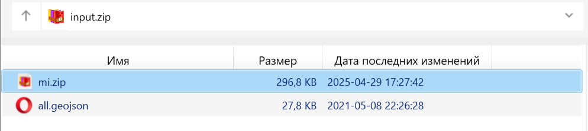

Проверка геометрии
==================

Проверяет корректность геометрий векторных объектов по методу GEOS.

На входе:

* ZIP-архив c векторными файлами. 

Данные в форматах, состоящих из одного файла (например, GeoJSON), должны быть в корне архива. Если формат состоит из нескольких файлов (например, ESRI Shapefile), каждый слой должен быть быть в виде отдельного ZIP-архива внутри этого архива. В одном архиве можно сочетать файлы разных форматов.

   Пример структуры архива: внутри архива input.zip лежат файл GeoJSON и ZIP-архив, содержащий файл в формате MapInfo TAB

На выходе:

* Файл CSV со списком ошибок и координат
* Файл GeoJSON с точками, которыми отмечены места ошибок

Запуск инструмента: https://toolbox.nextgis.com/t/check_geometries

.. figure:: _static/check_geometries_result.png
   :name: check_geometries_result_pic
   :align: center
   :width: 18cm

   Пример работы инструмента. Точки отмечают ошибки геометрии

**Попробуйте инструмент в действии**

1. Нажмите кнопку **Демо** над формой инструмента. Поля будут автоматически заполнены демонстрационными значениями.
2. Нажмите кнопку **Запустить**.

.. seealso::

   * `Проверка геометрии (QGIS) <https://toolbox.nextgis.com/t/qgis_check_geometries?from-related-tools=1>`_