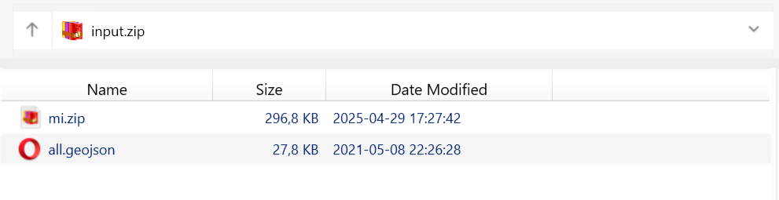
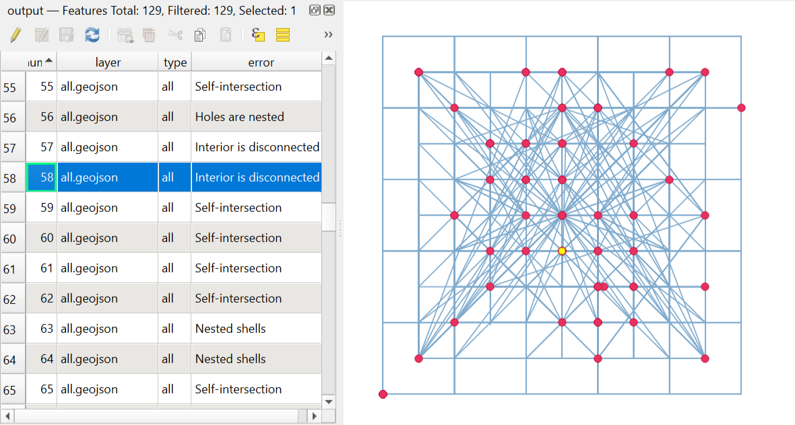

Check geometries
================

Checking the vector file for geometry validity. The output is a CSV file with a list of errors and coordinates and a GeoJSON file with geometries of the location of errors.

Inputs:

* ZIP archive with vector files. 

Single-file formats should be in the root of the archive. For multi-file formats such as ESRI Shapefile, each layer should be put in a separate ZIP inside the main input archive. Input archive may contain mixed files.

   Example of possible archive structure. Archive input.zip contains a single-file GeoJSON and a zipped MapInfo TAB

Outputs:

* CSV file containing the list of errors;
* GeoJSON file with points marking the placement of the errors.

Launch the tool: https://toolbox.nextgis.com/t/check_geometries

   Example output image

**Try the tool in action**

1. Click on the **Demo** button above the tool form. The fields are filled in with demo values.
2. Click on the **Run** button.

.. admonition:: Related tools

  * `Fix geometries <https://toolbox.nextgis.com/t/fix_geometries?from-related-tools=1>`_
  * `Fix geometries (QGIS) <https://toolbox.nextgis.com/t/qgis_fix_geometries?from-related-tools=1>`_
  * `Check geometries (QGIS) <https://toolbox.nextgis.com/t/qgis_check_geometries?from-related-tools=1>`_