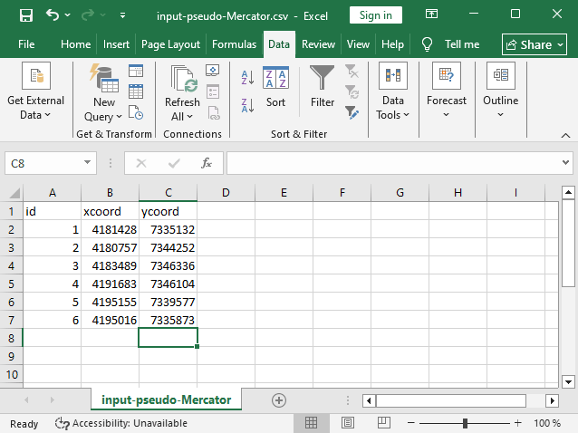
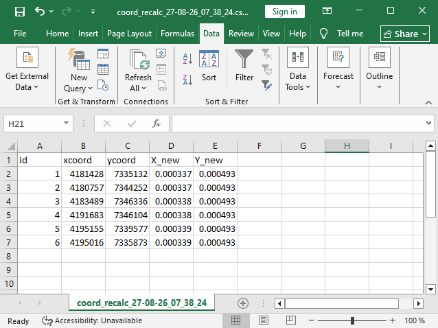

Перепроецирование координат
===========================

Инструмент перепроецирует координаты объектов, представленные в CSV-файле, в заданную систему координат.

На входе:

* Файл CSV - файл с перечнем объектов и их координатами
* Номер столбца координаты Х – порядковый номер столбца в загружаемом файле CSV, в котором расположены значения координаты Х (долгота). В качестве разделителя целой и дробной части используйте . (точку). 
* Номер столбца координаты Y – порядковый номер столбца в загружаемом файле CSV, в котором расположены значения координаты Y (широта). В качестве разделителя целой и дробной части используйте **точку**. 
* Номер начальной строки — порядковый номер строки, с которой следует начинать перепроецирование
* Исходная система координат - система координат, используемая в загружаемом CSV. Необходимо указать в формате proj4 (например, ``+proj=longlat +ellps=WGS84 +datum=WGS84 + no_defs``)
* Целевая система координат - система координат, в которую нужно перевести данные. Необходимо указать в формате proj4 (опциональный параметр, по умолчанию используется система координат ``+proj=longlat +ellps=WGS84 +datum=WGS84 + no_defs``)

На выходе:

* Файл CSV с перепроецированными координатами.

Запуск инструмента: https://toolbox.nextgis.com/t/coord_recalc

Пример работы инструмента:

   Пример исходных данных

   Пример результата работы инструмента: добавлены столбцы с новыми координатами

**Попробуйте инструмент в действии**

1. Нажмите кнопку **Демо** над формой инструмента. Поля будут автоматически заполнены демонстрационными значениями.
2. Нажмите кнопку **Запустить**.

.. seealso::

    * `Конвертация векторных слоев <https://toolbox.nextgis.com/t/convert?from-related-tools=1>`_
    * `KML в геоданные <https://toolbox.nextgis.com/t/kml2geodata?from-related-tools=1>`_