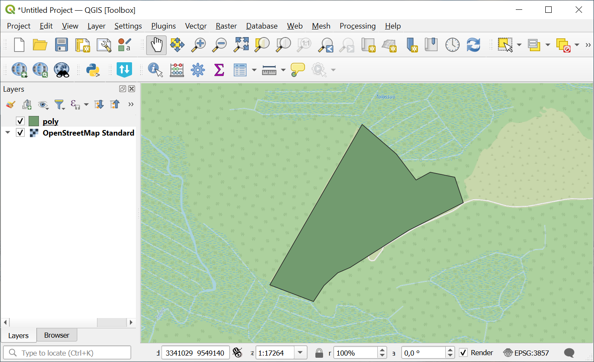

Coordinates to polygon
======================

Create polygon geometry from Excel or CSV file with lat/lon columns.

Inputs:

* Source file. Input table with lat/lon columns, supported formats:  XLSX,XLS,CSV;
* Output format. Select one of the options: GPKG, GEOJSON, SHP, TAB;
* Lat/Lon. Switch the order of the columns. By default, the tool presumes that the order is Longitude, then Latitude. If it's the opposite, tick this field.

Outputs:

* Geodata in the selected format.

Launch the tool: https://toolbox.nextgis.com/t/coords2poly

Example:

   Example output image

**Try the tool in action by downloading our example:**

`Input data set <https://nextgis.ru/data/toolbox/coords2poly/coords2poly_inputs.zip>`_ to test the tool. The archive contains step-by-step instructions.

`Result example <https://nextgis.ru/data/toolbox/coords2poly/coords2poly_outputs.zip>`_ of the tool run.

.. admonition:: Related tools

   * `Change attributes in the layer group <https://toolbox.nextgis.com/t/explication2poly>`_
