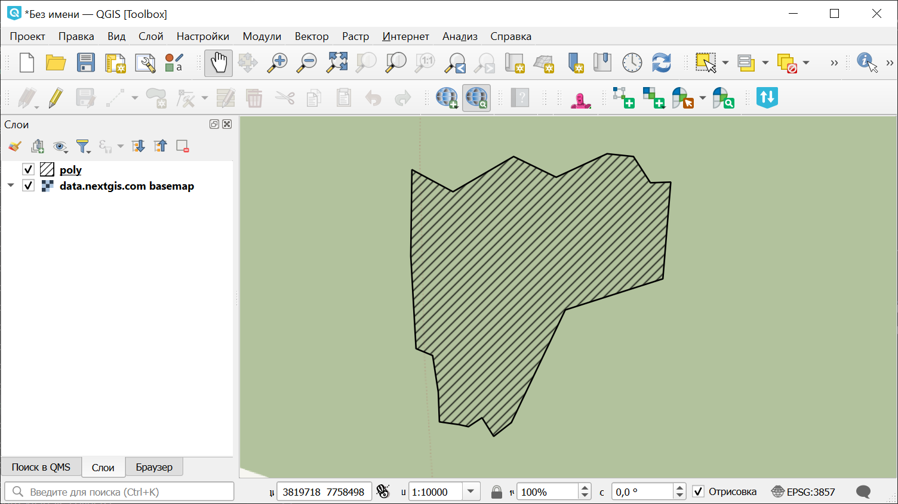

Абрис лесосеки: каталог координат в геоданные
=============================================

Построение полигона из таблицы с координатами поворотных точек.

На входе:

* Исходный файл. Таблица с координатами в формате XLSX,XLS,CSV;
* Выходной формат. Выберите одно из значений: GPKG, GEOJSON, SHP, TAB;
* Порядок колонок. Отметьте, если колонки в таблице расположены в порядке **Широта, Долгота**. По умолчанию порядок колонок распознаётся как Долгота, Широта.

На выходе:

* Геоданные в выбранном формате.

Запуск инструмента: https://toolbox.nextgis.com/t/coords2poly

Пример работы инструмента:

   Полученный абрис лесосеки, открытый в NextGIS QGIS

**Попробуйте инструмент в действии, скачав наш пример:**

`Набор исходных данных <https://nextgis.ru/data/toolbox/coords2poly/coords2poly_inputs_ru.zip>`_ для проверки работы инструмента. Внутри архива пошаговая инструкция.

`Пример результата <https://nextgis.ru/data/toolbox/coords2poly/coords2poly_outputs_ru.zip>`_ работы инструмента.

.. seealso:: 

   * `Абрис лесосеки: геоданные в экспликацию и координаты <https://toolbox.nextgis.com/t/poly2explication>`_
   * `Каталог учетных номеров <https://toolbox.nextgis.com/t/plk_catalog>`_
   * `Конвертация XML: Таксационное описание лесосеки <https://toolbox.nextgis.com/t/xml_tol_to_vector>`_
   * `Абрис лесосеки: экспликация (промеры) в геоданные <https://toolbox.nextgis.com/t/explication2poly>`_

