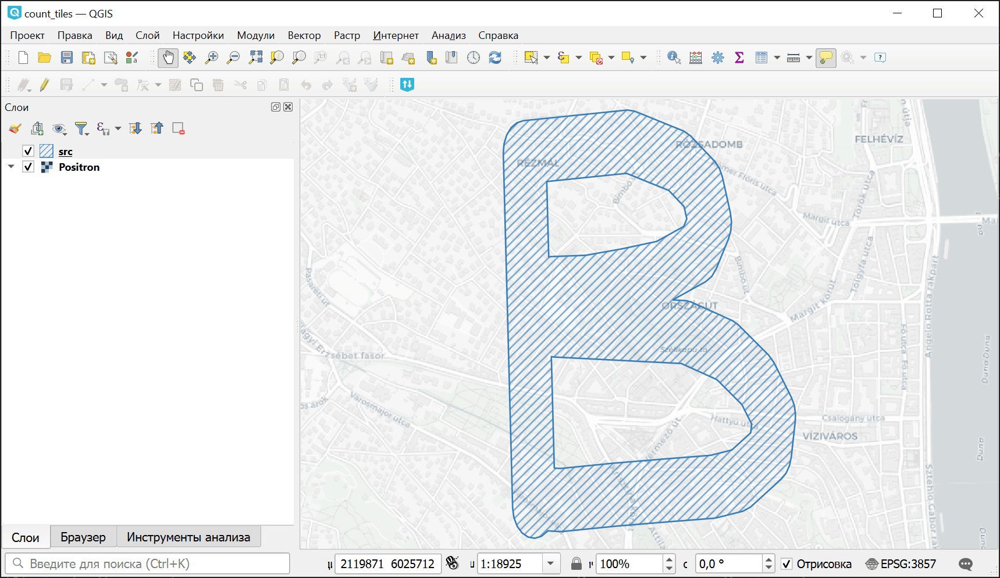

Подсчёт количества тайлов для полигона
======================================

Расчёт числа тайлов TMS для заданого полигона. Алгоритм строит геометрии тайлов, проверяет, входит ли тайл в полигон, и если входит, то засчитывает его.

На входе:

* Векторный файл OGR-совместимого формата или ZIP-архив с единственным слоем. Геометрия: полигон или мультиполигон. Используется только первый объект слоя.

На выходе:

* Текст: количество тайлов для каждого уровня зума и общее количество.

Запуск инструмента: https://toolbox.nextgis.com/t/count_tiles

Пример работы инструмента:

   Пример исходных данных

Пример результата работы инструмента::

    0: 1
    1: 1
    2: 1
    3: 1
    4: 1
    5: 1
    6: 1
    7: 1
    8: 1
    9: 2
    10: 2
    11: 2
    12: 2
    13: 3
    14: 3
    15: 5
    16: 14
    17: 47
    18: 148
    19: 491
    Total: 728

**Попробуйте инструмент в действии, скачав наш пример:**

1. Нажмите кнопку **Демо** над формой инструмента. Поля будут автоматически заполнены демонстрационными значениями.
2. Нажмите кнопку **Запустить**.
