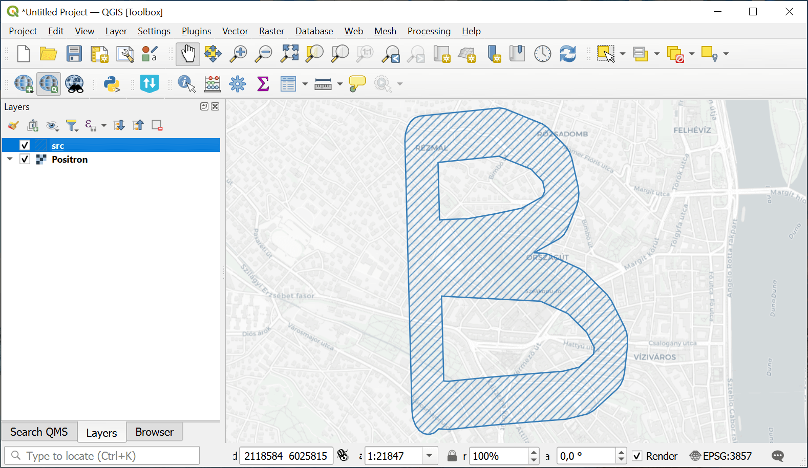

Count TMS tiles for polygon
===========================

Calculates the number of TMS tiles for a given vector polygon.

Inputs:

* Boundary polygon vector file in OGR format or ZIP-archive with single layer. Geometry: polygon or multipolygon. Only the frist feature of the layer is used.

Outputs:

* Text output listing the number of tiles for each zoom layer and the total tile count.

Launch the tool: https://toolbox.nextgis.com/t/count_tiles

Example:

   Example input

Example output::

    0: 1
    1: 1
    2: 1
    3: 1
    4: 1
    5: 1
    6: 1
    7: 1
    8: 1
    9: 2
    10: 2
    11: 2
    12: 2
    13: 3
    14: 3
    15: 5
    16: 14
    17: 47
    18: 148
    19: 491
    Total: 728

**Try the tool in action:**

**Try the tool in action**

1. Click on the **Demo** button above the tool form. The fields are filled in with demo values.
2. Click on the **Run** button.
