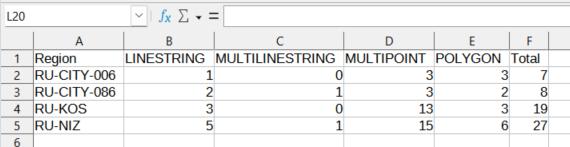

Counting intersections with polygon layers
==========================================

The tool counts the number of intersections between 2 sets of layers, one of the sets should contain only polygons. In other words, the tool finds, how many objects lay within area of interest, defined by polygons. The result is CSV file with information about each polygon.

Input:

* Area of interest - a set with one or several GeoJSON files, packed in ZIP-archive. Each file should consist only of 1 polygon. Names of the files will be displayed in resulting CSV.
* Objects - one or several vector layers of any geometry type (could differ among layers) in Esri Shapefile or GeoPackage format. Layer or layers should be packed in ZIP-archive.
* Group by layer - optional field. If the box is checked, data in CSV will be grouped by objects' layers. Otherwise - by geometry types of the objects.
* Separate records - optional field. If the box is checked, each category value (layers or geometry types, depending on the choice above) will be put into a separate record.

Output:

* CSV file with information, how many objects and of which geometry type lay within each polygon. 

   Resulting CSV

Launch tool: https://toolbox.nextgis.com/operation/crossing_borders

**Try it out using our sample:**

Download `input dataset <https://nextgis.ru/data/toolbox/crossing_borders/crossing_borders_inputs.zip>`_ to test the instrument. Step-by-step instructions included.

Get the `output <https://nextgis.ru/data/toolbox/crossing_borders/crossing_borders_outputs.zip>`_ to additionally check the results.
