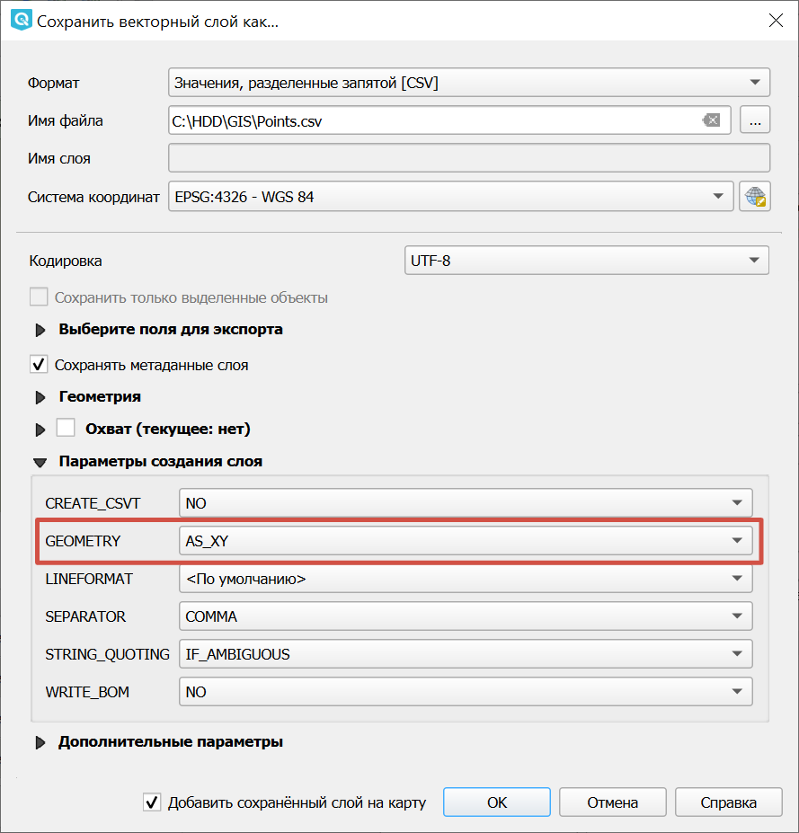

Извлечь высоты
==============

Инструмент извлекает значение высот в заданных точках из цифровой модели рельефа (DEM). Возвращает CSV-файл с координатами и высотами для заданных точек.

На входе:

*  ZIP-архив с CSV-файлом - CSV-файл с координатами точек. Разделитель для CSV-файла - запятая. Координаты представлены в градусах, разделитель целой и дробной части - точка. Названия колонок не должны содержать пробелов. Всё содержимое CSV файла (включая данные) должно быть на латинице.
*  Имя колонки с широтой - указывается заголовок, которым подписана колонка с широтой в CSV-файле. Регистр учитывается.
*  Имя колонки с долготой - указывается заголовок, которым подписана колонка с долготой в CSV-файле. Регистр учитывается.
*  Название цифровой модели рельефа - необходимо выбрать один из вариантов: ``alos, copernicus, meritdem, gebco``. Разрешение GEBCO - 15 угловых секунд (приблизительно 500 метров), у ALOS World 3D - 30 метров. 

На выходе:

*  Архивированный CSV-файл с координатами и высотами для заданных точек.

Чтобы экспортировать точечный слой в файл CSV с координатами, при сохранении в разделе **Паметры создания слоя** для поля GEOMETRY выберите ``AS_XY``. При этом в колонку X запишутся значения долготы, в колонку Y - широты.

   Экспорт точечного слоя в CSV

.. raw:: html

   <iframe width="720" height="405" src="https://rutube.ru/play/embed/6110c141543a4b13609b5d645736fca9/" frameBorder="0" allow="clipboard-write; autoplay" webkitAllowFullScreen mozallowfullscreen allowFullScreen></iframe>

Посмотреть видео на `youtube <https://youtu.be/yy3SlXBG6Xk>`_, `rutube <https://rutube.ru/video/6110c141543a4b13609b5d645736fca9/>`_.

Запуск инструмента: https://toolbox.nextgis.com/t/demInPoints

**Попробуйте инструмент в действии, скачав наш пример:**

`Набор исходных данных <https://nextgis.ru/data/toolbox/deminpoints/deminpoints_inputs_ru.zip>`_ для проверки работы инструмента. Внутри архива пошаговая инструкция.

`Пример результата <https://nextgis.ru/data/toolbox/deminpoints/deminpoints_outputs_ru.zip>`_ работы инструмента.

