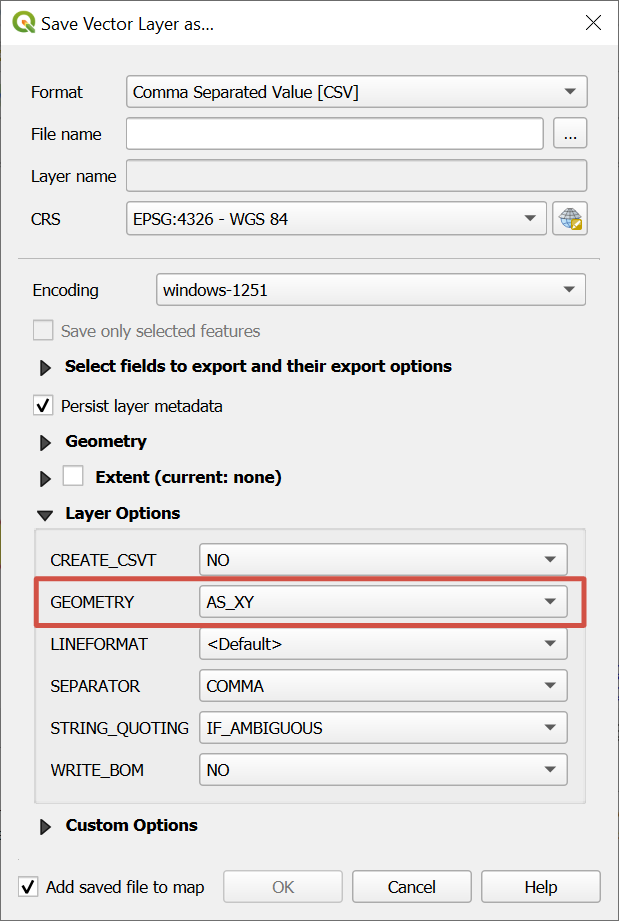

Extract elevations from DEM
===========================

The extraction of elevations from DEM. Returns CSV with coordinates and altitude.

Inputs:

*  ZIP-compressed CSV - CSV table with coordinates of points. Delimiter should be comma. Corrdinates are floating values. File should not have spaces and should contain only latin symbols.
*  Latitude - fieldname for Latitude column. Case-sensitive.
*  Longitude - fieldname for Lonitude column. Case-sensitive.
*  Elevation dataset - enter one of the following: ``gmted``, ``gebco``, ``alos``. GMTED2010 resolution is 7.5 sec (about 250 meters), GEBCO resolution is 15 sec (about 500 meters), ALOS World 3D - 30 meters. 

Outputs:

*  ZIP-compressed CSV-file with coordinates and elevation values for the points.

To save a point layer as a CSV file with coordinates, during export in the **Layer options** section select for the GEOMETRY field the option ``AS_XY``. The resulting file will have longitude in the X column and latitude in Y column. 

   Exporting point layer as CSV

Launch tool: https://toolbox.nextgis.com/operation/demInPoints

**Try it out using our sample:**

Download `input dataset <https://nextgis.com/data/toolbox/deminpoints/deminpoints_inputs.zip>`_ to test the instrument. Step-by-step instructions included.

Get the `output <https://nextgis.com/data/toolbox/deminpoints/deminpoints_outputs.zip>`_ to additionally check the results.
