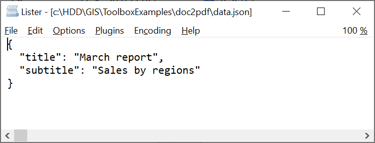

DOC(X) to PDF
=============

Convert DOC(X) to PDF with templating support. 

Inputs:

* Input DOC(X). Select DOC or DOCX file.
* Input data file. Select JSON file corresponding to template values. To view an example template, click **Demo** and donwload the input JSON file.

Outputs:

* PDF file

Launch the tool: https://toolbox.nextgis.com/t/doc2pdf

Example:

.. figure:: _static/doc2pdf_input.png
   :name: doc2pdf_input_pic
   :align: center
   :width: 16cm

   Example input DOCX

   Example JSON template

.. figure:: _static/doc2pdf_result.png
   :name: doc2pdf_result_pic
   :align: center
   :width: 16cm

   Example output

**Try the tool in action**

1. Click on the **Demo** button above the tool form. The fields are filled in with demo values.
2. Click on the **Run** button.
