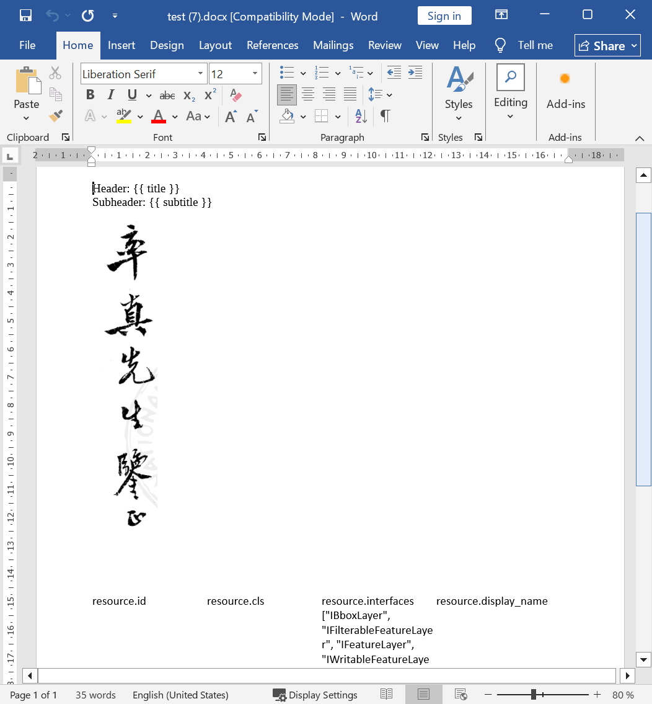
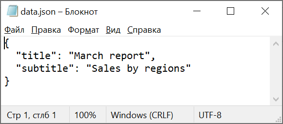
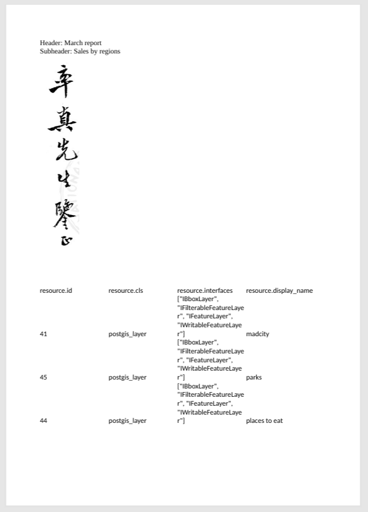

DOC(X) в PDF
============

Конвертация DOC(X) в PDF с поддержкой шаблонов. 

На входе:

* Файл DOC(X). Выберите файл DOC или DOCX.
* Файл с данными. Выберите файл JSON с данными для шаблона. Чтобы посмотреть пример шаблона, нажмите кнопку **Демо** и скачайте исходный файл JSON.

На выходе:

* Файл в формате PDF

Запуск инструмента: https://toolbox.nextgis.com/t/doc2pdf

Пример работы инструмента:

   Пример исходного документа

   Пример шаблона

   Пример результата работы инструмента

**Попробуйте инструмент в действии, скачав наш пример:**

1. Нажмите кнопку **Демо** над формой инструмента. Поля будут автоматически заполнены демонстрационными значениями.
2. Нажмите кнопку **Запустить**.

