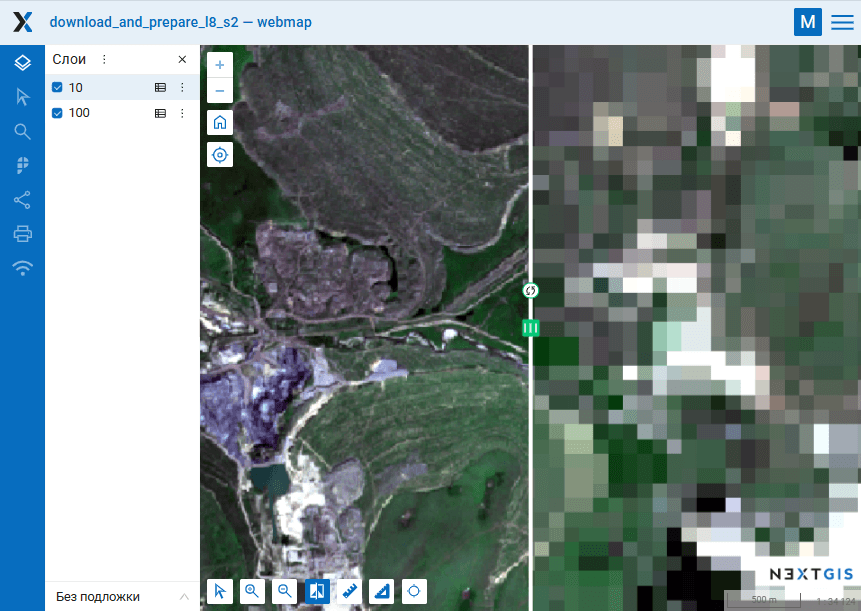

Подготовка и скачивание данных Sentinel-2
=====================================================

Инструмент загружает исходные данные, подготавливает снимки Sentinel-2, дает скачать результат.

Поддерживаются идентификаторы из каталога Copernicus, GoogleCloud или MPC (только L2A).

Нужные идентификаторы Copernicus можно получить:

* с помощью инструмента `Поиск снимков Sentinel через Copernicus <https://toolbox.nextgis.com/t/imagesearch>`_ или `Поиск ID сцен Sentinel-L2A и загрузка превью <https://toolbox.nextgis.com/t/s2_search>`_.
* На сайте https://dataspace.copernicus.eu. Там нужно зарегистрироваться, подобрать подходящий снимок и скопировать его ID.

На входе:

*  Идентификатор сцены Sentinel-2 (Level 1C и Level 2A), тип данных определяется автоматически по идентификатору;
*  Векторная маска, по которой будет обрезан снимок. Формат - GeoJSON, ESRI Shape (в zip-архиве) или любой другой однофайловый OGR-совместимый файл. Если обрезка снимка не требуется, оставьте поле пустым;
*  Перечень каналов. Список номеров, разделенных запятой. Каналы будут склеены в указанном порядке, например, для натуральных цветов - 4,3,2. Оставьте поле пустым для загрузки и склейки всех каналов;
*  Выходное разрешение снимка, указывается в метрах. Оставьте пустым для использования оригинального пространственного разрешения. Если ввести число, то все каналы снимка будут искусственно интерполированы к указанному разрешению. Используется кубическая интерполяция.

На выходе

*  GeoTIFF готового снимка

Запуск инструмента: https://toolbox.nextgis.com/t/download_and_prepare_l8_s2

.. raw:: html

   <iframe width="720" height="405" src="https://rutube.ru/play/embed/757dd9d2f0c2831f996592e823c351b7/" frameBorder="0" allow="clipboard-write; autoplay" webkitAllowFullScreen mozallowfullscreen allowFullScreen></iframe>

Посмотреть видео на `youtube <https://youtu.be/vMFkarTFAk0>`_, `rutube <https://rutube.ru/video/757dd9d2f0c2831f996592e823c351b7/>`_.

Посмотреть результат на интерактивной карте: https://demo.nextgis.com/resource/4805/display?panel=layers

   Разные разрешения для одной территории:  10 м и 100 м. Для сравнения слоёв используется `шторка <https://docs.nextgis.ru/docs_ngweb/source/webmaps_client.html#ngw-webmaps-client-tools-swipe>`_
   

**Попробуйте инструмент в действии**

1. Нажмите кнопку **Демо** над формой инструмента. Поля будут автоматически заполнены демонстрационными значениями.
2. Нажмите кнопку **Запустить**.
 

.. seealso::

   * `Набор тайлов из растра <https://toolbox.nextgis.com/t/raster2tiles?from-related-tools=1>`_
   
   * Скачать превью выбранных сцен, чтобы определиться, какие данные загружать полностью, можно при помощи инструмента `Поиск ID сцен Sentinel-L2A и загрузка превью <https://toolbox.nextgis.com/t/s2_search?from-related-tools=1>`_.

   * `Нормализованный разностный индекс <https://toolbox.nextgis.com/t/ndi?from-related-tools=1>`_ (NDVI, NDWI, NDSI и т.д.)

   * `Кластеризация изображений <https://toolbox.nextgis.com/t/image_clustering?from-related-tools=1>`_
