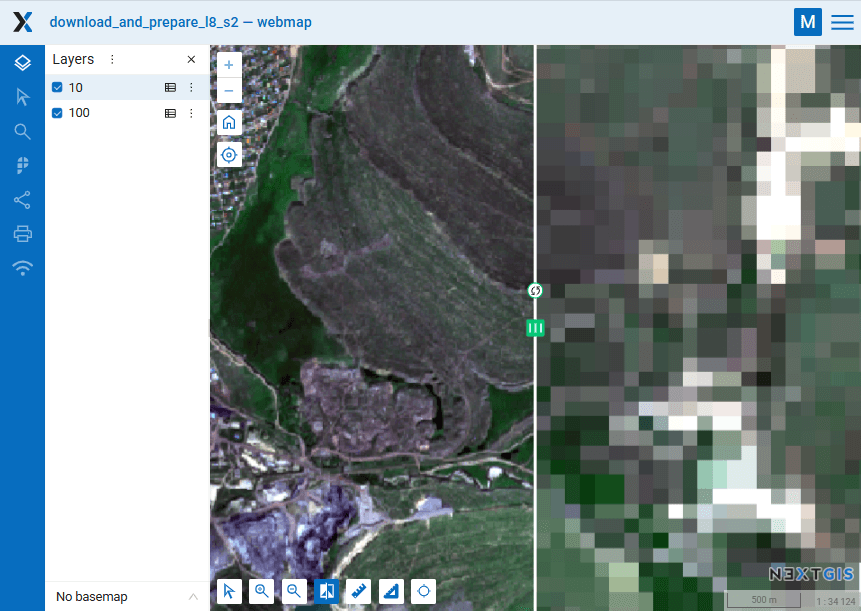

Prepare and download Sentinel-2 data
==============================================

The tool downloads source data, prepares Sentinel-2 data and provides link to download the result.

Supported ID types are Copernicus, GoogleCloud and MPC (L2A only).

You can get ID for Copernicus catalog:

* using the tool `Copernicus Sentinel image search <https://toolbox.nextgis.com/t/imagesearch>`_ or `Sentinel-2 scenes to GPKG <https://toolbox.nextgis.com/t/s2_search>`_;
* on https://dataspace.copernicus.eu: sign up, find an image for your area of interest and copy its ID.

Inputs:

* Scene identifier of Sentinel-2 (Level 1C and Level 2A). 
* Vector mask to clip the image. The format is GeoJSON, ESRI Shape (in a ZIP-archive) or any other OGR-compatible single-file format. If you don't need to clip the scene, leave this field empty.
* A list of bands. A comma separated list of numbers. The bands will be merged in the specified order, for example 4,3,2. Leave this field empty to merge all bands.
* Output spatial resolution of the scene, in meters. Leave this field empty for original spatial resolution. If number is set, then all bands will be upscaled or downscaled to it using cubic interpolation. The example of interpolation is available `here <https://docs.nextgis.com/_images/download_and_prepare_l8_s2.png>`_.

Outputs:

*  GeoTIFF output image

Launch the tool: https://toolbox.nextgis.com/t/download_and_prepare_l8_s2

.. raw:: html

   <iframe width="560" height="315" src="https://www.youtube.com/embed/avKvKrsjDSI?si=5ODVonI0TYbDtw4v" title="YouTube video player" frameborder="0" allow="accelerometer; autoplay; clipboard-write; encrypted-media; gyroscope; picture-in-picture; web-share" referrerpolicy="strict-origin-when-cross-origin" allowfullscreen></iframe>

Watch on `youtube <https://youtu.be/avKvKrsjDSI?si=sJZqD5IEeZmJOxIJ>`_.

   Same territory, different resolutions: 10 m and 100 m. `Swipe <https://docs.nextgis.com/docs_ngweb/source/webmaps_client.html#ngw-webmaps-client-tools-swipe>`_ is used to compare the two layers

View the result on an interactive map: https://demo.nextgis.com/resource/4805/display?panel=layers

**Try the tool in action**

1. Click on the **Demo** button above the tool form. The fields are filled in with demo values.
2. Click on the **Run** button.

.. note:: You can download previews of the scenes using the gool `Sentinel-2 scenes to GPKG <https://toolbox.nextgis.com/t/s2_search>`_ to determine for which of them to download the full raster images.

.. admonition:: Related tools

   * `Sentinel-2 scenes to GPKG <https://toolbox.nextgis.com/t/s2_search?from-related-tools=1>`_
   * `Normalized difference index <https://toolbox.nextgis.com/t/ndi?from-related-tools=1>`_
   * `Image clustering <https://toolbox.nextgis.com/t/image_clustering?from-related-tools=1>`_
   * `Tileset from raster <https://toolbox.nextgis.com/t/raster2tiles?from-related-tools=1>`_
