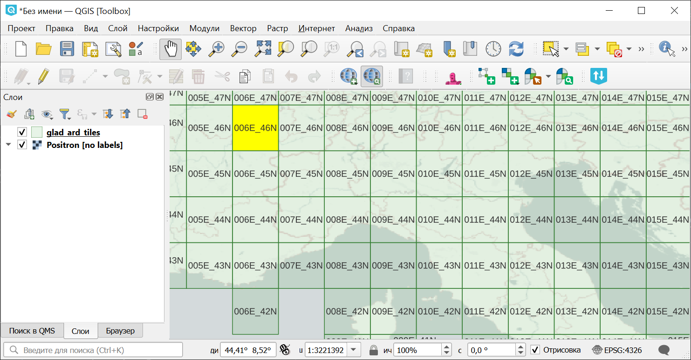
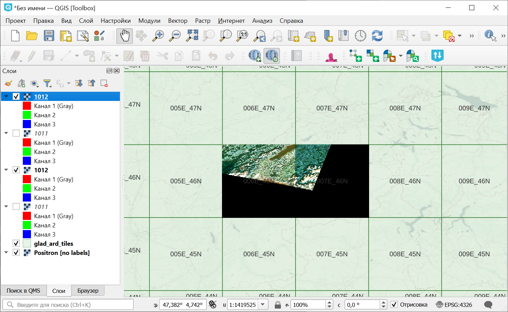

Загрузить Landsat Analysis Ready Data (GLAD ARD)
================================================

Генерирует команды для скачивания Landsat Analysis Ready Data (GLAD ARD) с https://glad.umd.edu/ard/home. 

Данные организованы следующим образом:

ARD-ID тайла формируется из координат нижнего левого угла ячейки сетки. Вы можете скачать :download:`разграфку тайлов <https://glad.umd.edu/users/Potapov/ARD/Global_ARD_tiles.zip>` в формате ESRI Shapefile.

   Разграфка тайлов ARD, выбран тайл 006E_46N

Нумерация 16-дневных интервалов сквозная с 1997 года. Идентификаторы интервалов интересующего вас периода можно посмотреть в :download:`таблице <https://glad.umd.edu/users/Potapov/ARD/16d_intervals.xlsx>`.

На входе:

* CSV файл со списком ID тайлов, записанных в соответствующем формате, например ``039E_44N``;
* Начальный интервал - цифровой ID первого 16-дневного интервала, с которым пересекается интересующий вас период;
* Конечный интервал - цифровой ID последнего 16-дневного интервала нужного периода.

На выходе:

* BAT-файл для Windows;
* TXT-файл со списком адресов для менеджеров закачек.

Запуск инструмента: https://toolbox.nextgis.com/t/download_glad

Пример данных, скачанных с помощью полученного BAT-файла:

   Тайлы в NextGIS QGIS, открытые поверх разграфки

**Попробуйте инструмент в действии, скачав наш пример:**

`Набор исходных данных <https://nextgis.ru/data/toolbox/download_glad/download_glad_inputs_ru.zip>`_ для проверки работы инструмента. Внутри архива пошаговая инструкция.

`Пример результата <https://nextgis.ru/data/toolbox/download_glad/download_glad_outputs_ru.zip>`_ работы инструмента.

.. seealso::

   `Поиск и импорт превью сцен Sentinel-2 в GPKG <https://toolbox.nextgis.com/t/s2_search>`_
   `Подготовка и скачивание данных Sentinel-2 <https://toolbox.nextgis.com/t/download_and_prepare_l8_s2>`_
   `Радиометрическая калибровка данных Landsat <https://toolbox.nextgis.com/t/landsat_to_radiance>`_
   `Расчёт спектрального альбедо объектов по данным Landsat <https://toolbox.nextgis.com/t/landsat_to_reflectance>`_