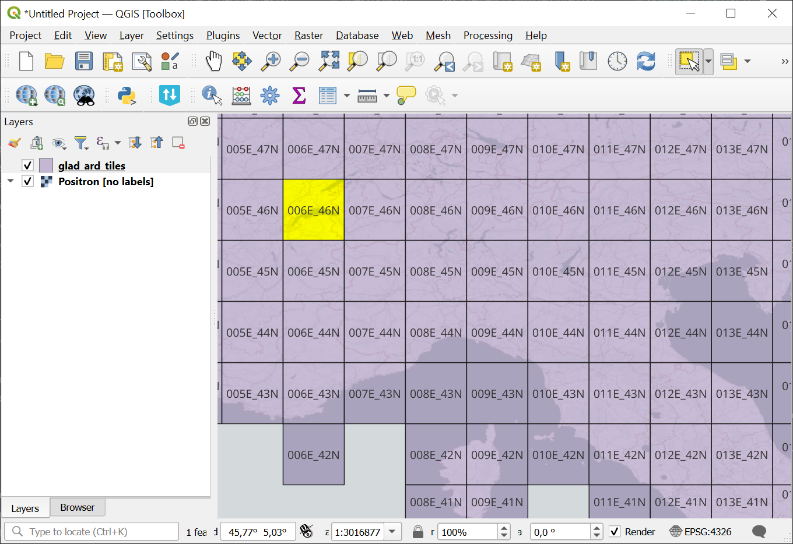
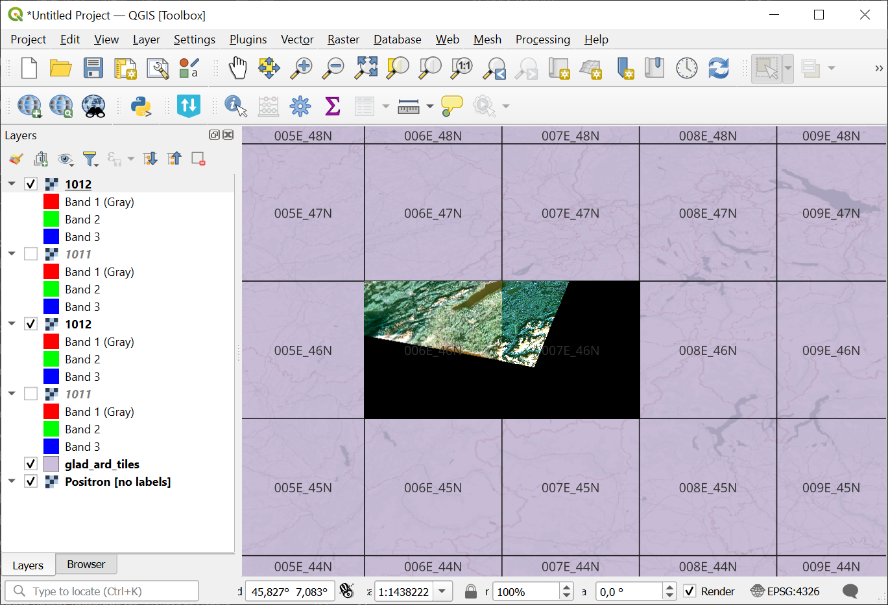

Landsat Analysis Ready Data (GLAD ARD) download helper
======================================================

Generates commands to download Landsat Analysis Ready Data (GLAD ARD, https://glad.umd.edu/ard/home).  

The data is organized as follows:

ARD tile name contains the coordinates of the bottom left corner of the grid cell. You can see the online interactive `grid <https://demo.nextgis.com/resource/9192/display?panel=layers>`_.

   ARD tile grid, the name of the selected tile is 006E_46N

Data collected in a 16-day interval are consolidated into a single ARD composite. The intervals are numbered consecutively since 1997. See the IDs of the intervals intersecting with your period of interest in the :download:`table  <https://glad.umd.edu/users/Potapov/ARD/16d_intervals.xlsx>`.

Inputs:

* CSV file containing a list of tile names, i.e. ``006E_46N``;
* Starting interval - ID of the first 16-day interval intersecting with your period of interest;
* Ending interval - ID of the last 16-day interval of your period of interest.

Output:

* BAT file for Windows;
* TXT file containing a list for wget / curl.

Launch the tool: https://toolbox.nextgis.com/t/download_glad

Example data downloaded using the BAT file provided by the tool.

   Tiles in QGIS opened alongside the grid

**Try the tool in action by downloading our example:**

`Input data set <https://nextgis.ru/data/toolbox/download_glad/download_glad_inputs.zip>`_ to test the tool. The archive contains step-by-step instructions.

`Result example <https://nextgis.ru/data/toolbox/download_glad/download_glad_outputs.zip>`_ of the tool run.

.. note:: Related tools

   * `Search and save Sentinel-2 scene previews to GPKG <https://toolbox.nextgis.com/t/s2_search>`_
   * `Prepare and download Sentinel-2 data <https://toolbox.nextgis.com/t/download_and_prepare_l8_s2>`_
   * `Landsat radiometric calibration <https://toolbox.nextgis.com/t/landsat_to_radiance>`_
   * `Landsat reflectance calculation <https://toolbox.nextgis.com/t/landsat_to_reflectance>`_
