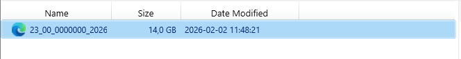
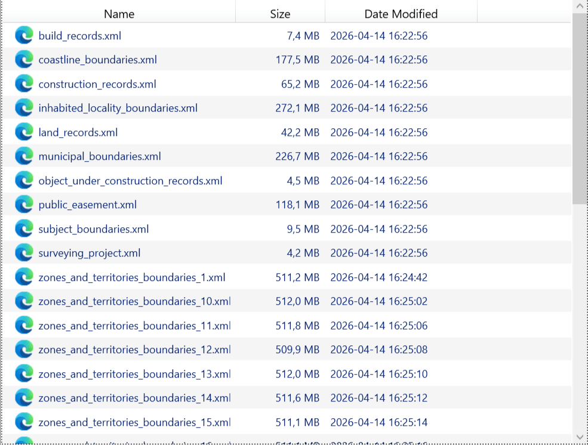

Разделение выписок ЕГРН
=======================

Запуск инструмента: https://toolbox.nextgis.com/t/egrn_splitter

Разбивает выписки ЕГРН огромного размера по слоям, уменьшая таким образом объем данных для дальнейшей конвертации. Это позволяет обрабатывать такие выписки инструментами `Дежурная кадастровая карта <https://toolbox.nextgis.com/t/dezhurcad>`_ или `Конвертация данных ЕГРН <https://toolbox.nextgis.com/t/import_egrn>`_.

На входе:

* Исходная выписка в ZIP.

На выходе:

* ZIP-архив, внутри XML-файлы на каждый слой (может быть несколько нумерованных файлов, если в слое много объектов)ы.

Пример работы инструмента:

   Пример исходных данных: распакованная выписка занимает 14 GB

   Пример результата работы инструмента: выписка разбита по слоям и по крупным блокам

**Попробуйте инструмент в действии:**

1. Нажмите кнопку **Демо** над формой инструмента. Поля будут автоматически заполнены демонстрационными значениями.
2. Нажмите кнопку **Запустить**.

.. seealso::

   * `Конвертация данных ЕГРН <https://toolbox.nextgis.com/t/import_egrn?from-related-tools=1>`_
   * `Дежурная кадастровая карта <https://toolbox.nextgis.com/t/dezhurcad?from-related-tools=1>`_
   * `Отчет по ПЗЗ по участку <https://toolbox.nextgis.com/t/pzz_report?from-related-tools=1>`_