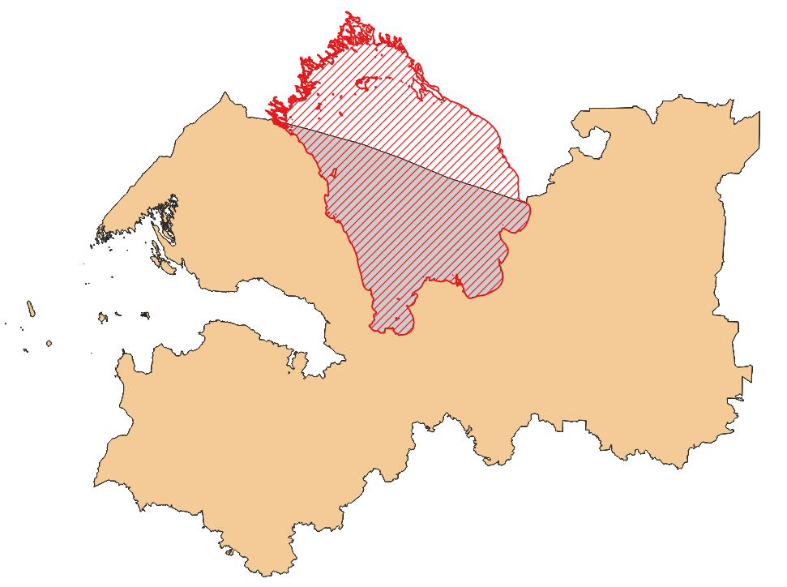

Удалить области пересечения из слоя
===================================

Инструмент удаляет в полигональном слое области, пересекающиеся с объектами из другого слоя. Исходные векторные слои должны иметь одинаковую систему координат.

На входе:

* Исходный векторный слой, из которого нужно удалить области. ZIP-архив с ESRI Shapefile или отдельный файл формата, поддерживаемого OGR.
* Векторный слой с объектами, области которых нужно вычесть из объектов исходного слоя. ZIP-архив с ESRI Shapefile или отдельный файл формата, поддерживаемого OGR.

На выходе:

* Векторный слой с результатами вычитания областей из исходного слоя.

.. raw:: html

   <iframe width="720" height="405" src="https://rutube.ru/play/embed/29c5a454cb52ff070d29f649424d77d3/" frameBorder="0" allow="clipboard-write; autoplay" webkitAllowFullScreen mozallowfullscreen allowFullScreen></iframe>

Посмотреть видео на `youtube <https://youtu.be/-SoRofcKSb4>`_, `rutube <https://rutube.ru/video/29c5a454cb52ff070d29f649424d77d3/>`_.

Запуск инструмента: https://toolbox.nextgis.com/t/eraser

Посмотреть исходные данные и результаты расчётов на интерактивной карте: https://demo.nextgis.com/resource/4611/display?panel=info

   Пример результата работы инструмента

**Попробуйте инструмент в действии, скачав наш пример:**

`Набор исходных данных <https://nextgis.ru/data/toolbox/eraser/eraser_inputs_ru.zip>`_ для проверки работы инструмента. Внутри архива пошаговая инструкция.

`Пример результата <https://nextgis.ru/data/toolbox/eraser/eraser_outputs_ru.zip>`_ работы инструмента.

.. seealso::

   * `Пересечение полигонов <https://toolbox.nextgis.com/t/vectorclip>`_
   * `Пересечение слоёв <https://toolbox.nextgis.com/t/intersect_layers>`_