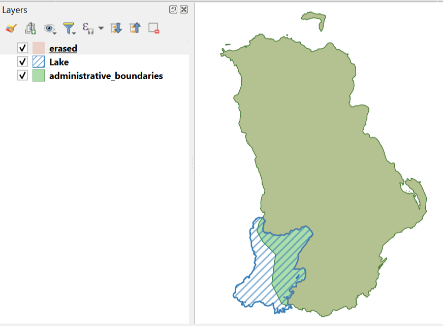

Erase overlapping areas from layer
======================================

Erases parts of polygonal features, overlapping with geometries from another layer.

Inputs:

* Target layer (erase from) - file in OGR-supported format (ZIP archive for ESRI Shapfile);
* Layer with subtractable objects. File in OGR-supported format (ZIP archive for ESRI Shapfile).

Outputs:

* File with modified features in the same format.

Launch the tool: https://toolbox.nextgis.com/t/eraser

   Administratived boundaries minus the lake

**Try the tool in action**

1. Click on the **Demo** button above the tool form. The fields are filled in with demo values.
2. Click on the **Run** button.

.. admonition:: Related tools

  * `Layer intersection <https://toolbox.nextgis.com/t/vectorclip?from-related-tools=1>`_
  * `Intersection registry <https://toolbox.nextgis.com/t/intersect_layers?from-related-tools=1>`_