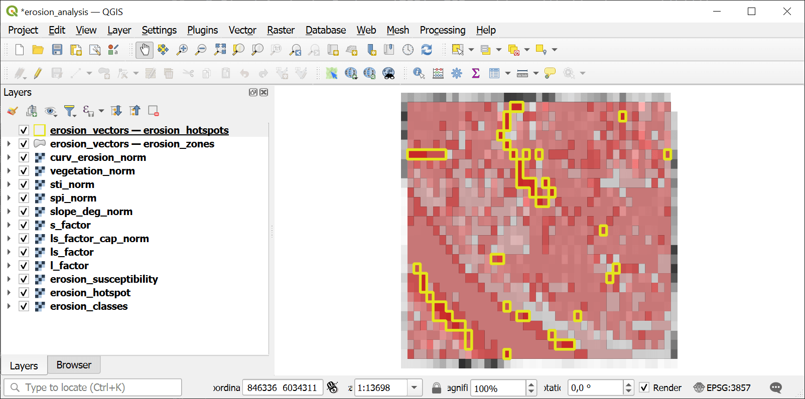

Erosion Susceptibility Analysis
===============================

RUSLE-based erosion susceptibility analysis using LS-factor, STI, SPI, profile curvature, and slope. Produces an Erosion Susceptibility Index (ESI) scaled 0-100 with 5-level classification.

Inputs:

* Terrain Analysis Package (ZIP). ZIP file from `Comprehensive Terrain Analysis <https://toolbox.nextgis.com/t/terrain_analysis>`_ containing DEM, slope, flow accumulation, curvature, STI, SPI, and manifest.json
* Weight: LS-Factor. Weight for the LS-factor indicator (default: 0.35)
* Weight: STI. Weight for the Sediment Transport Index (default: 0.25)
* Weight: SPI. Weight for the Stream Power Index (default: 0.15)
* Weight: Curvature. Weight for the profile curvature indicator (default: 0.10)
* Weight: Slope. Weight for the slope indicator (default: 0.15)
* Hotspot Threshold. ESI value above which areas are classified as hotspots (default: 65)
* Spectral Indices Package (ZIP). Optional ZIP from spectral_indices with vegetation index aggregates. When provided, a vegetation indicator is added to the weighted overlay.
* Weight: Vegetation Index. Weight for the vegetation index indicator (default: 0.10). Only used when spectral_zip is provided. Other weights are scaled down proportionally.

Outputs:

* Erosion Analysis Package (ZIP). ZIP archive with erosion susceptibility rasters, vectors, statistics, and manifest
* Summary. Human-readable summary of the erosion analysis results
* Manifest JSON. JSON manifest string describing all outputs

Launch the tool: https://toolbox.nextgis.com/t/erosion_analysis

Example:

.. figure:: _static/analysis_input_en.png
   :name: erosion_analysis_input_pic
   :align: center
   :width: 20cm

   Example input

   Example output

**Try the tool in action**

1. Click on the **Demo** button above the tool form. The fields are filled in with demo values.
2. Click on the **Run** button.

.. admonition:: Related tools

   * `Comprehensive Terrain Analysis <https://toolbox.nextgis.com/t/terrain_analysis>`_
   * `Flood Susceptibility Analysis <https://toolbox.nextgis.com/t/flood_analysis?from-related-tools=1>`_
   * `Landslide Susceptibility Analysis <https://toolbox.nextgis.com/t/landslide_analysis?from-related-tools=1>`_
   * `Wildfire Susceptibility Analysis (Topographic) <https://toolbox.nextgis.com/t/wildfire_analysis?from-related-tools=1>`_