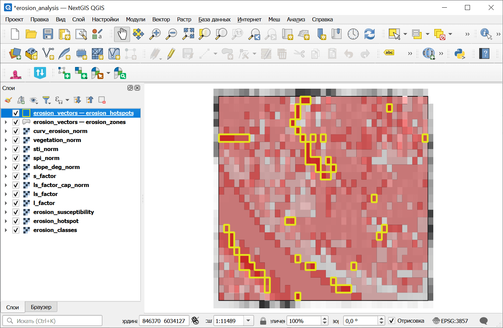

Анализ подверженности эрозии
============================

Анализ подверженности эрозии на основе RUSLE с использованием LS-фактора, STI, SPI, профильной кривизны и уклона. Создает индекс подверженности эрозии (ESI) от 0 до 100 с 5-уровневой классификацией.

На входе:

* Пакет анализа рельефа (ZIP). ZIP-файл, полученный из инструмента `Комплексный анализ рельефа <https://toolbox.nextgis.com/t/terrain_analysis>`_, содержит ЦМР, уклон, аккумуляцию стока, кривизну, STI, SPI и manifest.json;
* Вес: LS-фактор. Вес индикатора LS-фактора (по умолчанию: 0.35);
* Вес: STI. Вес индекса транспорта наносов (по умолчанию: 0.25);
* Вес: SPI. Вес индекса мощности потока (по умолчанию: 0.15);
* Вес: Кривизна. Вес индикатора профильной кривизны (по умолчанию: 0.10);
* Вес: Уклон. Вес индикатора уклона (по умолчанию: 0.15);
* Порог горячих точек. Значение ESI, выше которого области классифицируются как горячие точки (по умолчанию: 65);
* Пакет спектральных индексов (ZIP). Необязательный ZIP с агрегатами вегетационного индекса, полученный инструментом `Вычисление спектральных индексов <https://toolbox.nextgis.com/t/spectral_indices>`_. При указании в взвешенное наложение добавляется вегетационный индикатор;
* Вес: Вегетационный индекс. Вес индикатора вегетационного индекса (по умолчанию: 0.10). Используется только при наличии spectral_zip. Остальные веса пропорционально уменьшаются.

На выходе:

* Пакет анализа эрозии (ZIP). ZIP-архив с растрами подверженности эрозии, векторами, статистикой и манифестом
* Сводка. Текстовая сводка результатов анализа эрозии
* Манифест JSON. JSON-манифест, описывающий все результаты

Запуск инструмента: https://toolbox.nextgis.com/t/erosion_analysis

Пример работы инструмента:

.. figure:: _static/erosion_analysis_input_ru.png
   :name: erosion_analysis_input_pic
   :align: center
   :width: 20cm

   Пример исходных данных

   Пример результата работы инструмента

**Попробуйте инструмент в действии:**

1. Нажмите кнопку **Демо** над формой инструмента. Поля будут автоматически заполнены демонстрационными значениями.
2. Нажмите кнопку **Запустить**.

.. seealso::

   * `Анализ подверженности затоплению <https://toolbox.nextgis.com/t/flood_analysis?from-related-tools=1>`_
   * `Анализ подверженности оползням <https://toolbox.nextgis.com/t/landslide_analysis?from-related-tools=1>`_
   * `Анализ подверженности лесным пожарам (топографический) <https://toolbox.nextgis.com/t/wildfire_analysis?from-related-tools=1>`_
