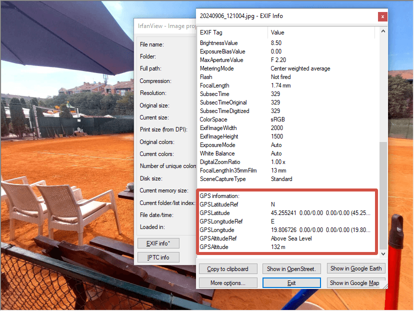
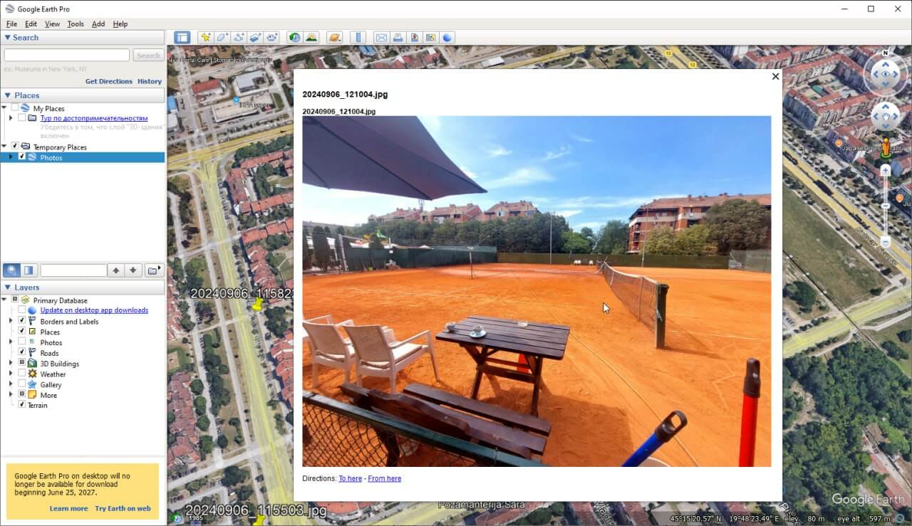

Фото с EXIF в KMZ
=================

Превращение одного или нескольких фото с тегами EXIF в векторный файл KMZ (Google Earth). С его помощью вы сможете разместить свои фотографии в настольной версии Google Earth (Google Earth Pro). 

Если у фотографий нет тэгов, но вы записывали трек во время съёмки, то геолокацию из него можно добавить к изображениям с помощью инструмента `Добавление координат к фотографиям <https://toolbox.nextgis.com/t/gpx2exif?from-related-tools=1>`_

.. note:: Также из снимков с геотэгами вы можете сделать интерактивную веб-карту на платформе NextGIS Web при помощи инструмента `Фото с EXIF в слой NGW <https://toolbox.nextgis.com/t/exif2resource?from-related-tools=1>`_.

На входе:

* Фотографии - Выберите один JPEG с геотегами EXIF или ZIP-архив, содержащий такие фото.

На выходе:

* Файл KMZ.

Запуск инструмента: https://toolbox.nextgis.com/t/exif2kmz

Пример работы инструмента:

   Пример исходных данных: фотография с EXIF-тэгами геолокации

   Пример результата работы инструмента: точка с фотографией в Google Earth

**Попробуйте инструмент в действии:**

1. Нажмите кнопку **Демо** над формой инструмента. Поля будут автоматически заполнены демонстрационными значениями.
2. Нажмите кнопку **Запустить**.

.. seealso::

   * `Добавление координат к фотографиям <https://toolbox.nextgis.com/t/gpx2exif?from-related-tools=1>`_
   * `Фото с EXIF в слой NGW <https://toolbox.nextgis.com/t/exif2resource?from-related-tools=1>`_