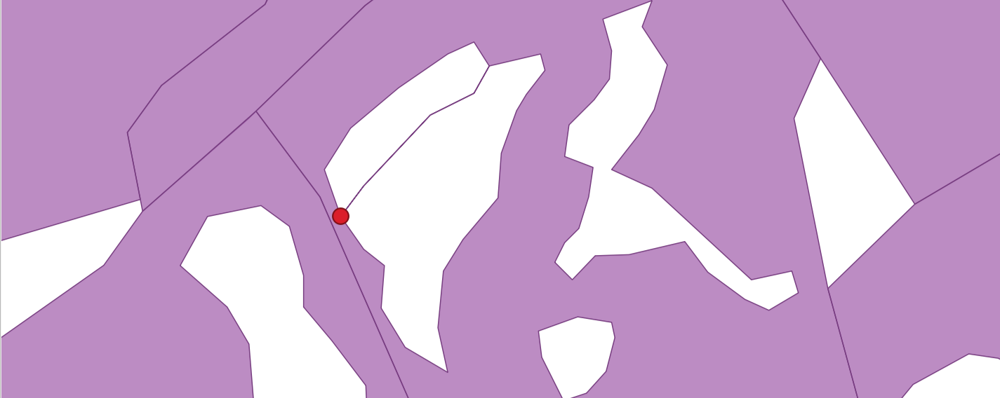
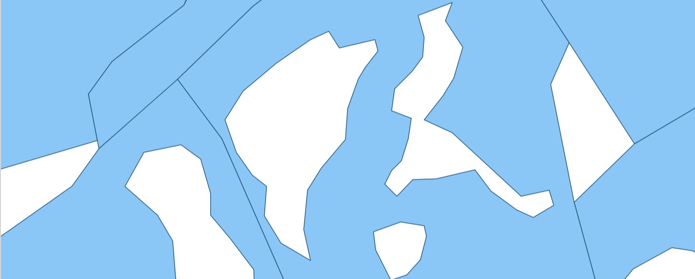

Исправление геометрий
=====================

Исправление некорректных геометрий в векторных файлах. Выявить наличие некорректных геометрий можно при помощи инструмента `Проверка геометрии <https://toolbox.nextgis.com/t/check_geometries>`_.

На входе:

* ZIP-архив c векторными файлами. Поддерживаются векторные файлы форматов, состоящих из одного файла (например, Geopackage, GeoJSON и т.д.)

На выходе:

* Файл с исправленными геометриями в том же формате, что исходный.

Запуск инструмента: https://toolbox.nextgis.com/t/fix_geometries

   
   Исходные данные, где выявлено самопересечение

   Пример результата работы инструмента: ошибка исправлена

**Попробуйте инструмент в действии, скачав наш пример:**

`Набор исходных данных <https://nextgis.ru/data/toolbox/fix_geometries/fix_geometries_inputs_ru.zip>`_ для проверки работы инструмента. Внутри архива пошаговая инструкция.

`Пример результата <https://nextgis.ru/data/toolbox/fix_geometries/fix_geometries_outputs_ru.zip>`_ работы инструмента.
