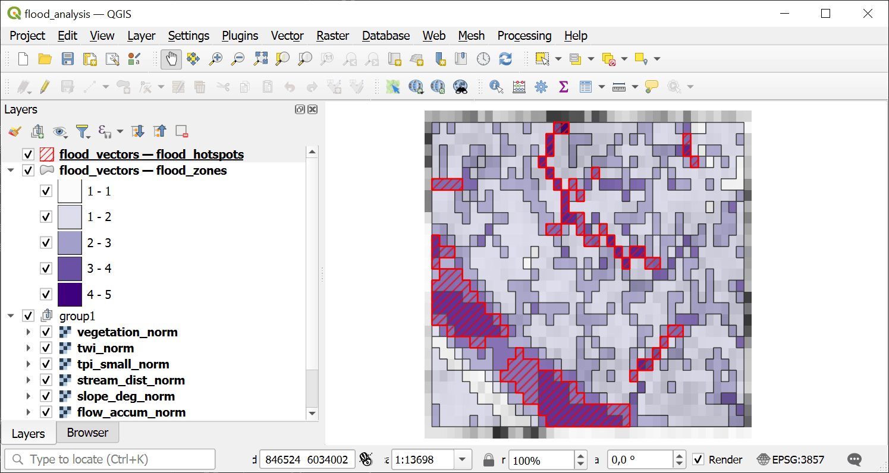

Flood Susceptibility Analysis
=============================

Terrain-based flood susceptibility analysis using TWI, log-transformed flow accumulation, inverse slope, inverse stream distance, and inverse TPI. Produces a Flood Susceptibility Index (FSI) scaled 0-100 with 5-level classification.

Inputs:

* Terrain Analysis Package (ZIP). ZIP file from terrain_analysis containing DEM, slope, TWI, flow accumulation, TPI, streams, flow direction, and manifest.json
* Weight: TWI. Weight for the Topographic Wetness Index indicator (default: 0.30)
* Weight: Flow Accumulation. Weight for the log-transformed flow accumulation indicator (default: 0.25)
* Weight: Slope (inverted). Weight for the inverted slope indicator — flat areas have higher flood risk (default: 0.20)
* Weight: Stream Distance (inverted). Weight for the inverted stream distance indicator — closer to streams means higher risk (default: 0.15)
* Weight: TPI (inverted). Weight for the inverted TPI indicator — depressions have higher flood risk (default: 0.10)
* Hotspot Threshold. FSI value above which areas are classified as flood hotspots (default: 70)
* Spectral Indices Package (ZIP). Optional ZIP from spectral_indices with vegetation index aggregates. When provided, a vegetation indicator is added to the weighted overlay.
* Weight: Vegetation Index. Weight for the vegetation index indicator (default: 0.10). Only used when spectral_zip is provided. Other weights are scaled down proportionally.

Outputs:

* Flood Analysis Package (ZIP). ZIP archive with flood susceptibility rasters, vectors, statistics, and manifest
* Summary. Human-readable summary of the flood analysis results
* Manifest JSON. JSON manifest string describing all outputs

Launch the tool: https://toolbox.nextgis.com/t/flood_analysis

Example:

.. figure:: _static/analysis_input_en.png
   :name: flood_analysis_input_pic
   :align: center
   :width: 20cm

   Example input

   Example output

**Try the tool in action**

1. Click on the **Demo** button above the tool form. The fields are filled in with demo values.
2. Click on the **Run** button.

.. admonition:: Related tools

   * `Erosion Susceptibility Analysis <https://toolbox.nextgis.com/t/erosion_analysis?from-related-tools=1>`_
   * `Landslide Susceptibility Analysis <https://toolbox.nextgis.com/t/landslide_analysis?from-related-tools=1>`_
   * `Wildfire Susceptibility Analysis (Topographic) <https://toolbox.nextgis.com/t/wildfire_analysis?from-related-tools=1>`_
