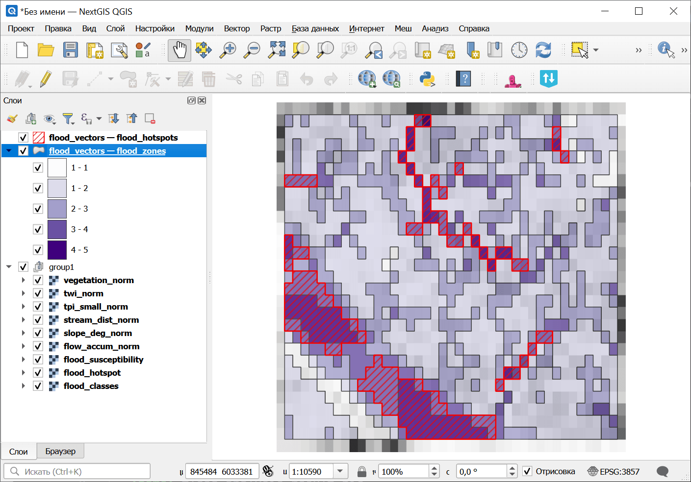

Анализ подверженности затоплению
================================

Анализ подверженности затоплению на основе рельефа с использованием TWI, логарифмированной аккумуляции стока, обратного уклона, обратного расстояния до водотоков и обратного TPI. Создает индекс подверженности затоплению (FSI) от 0 до 100 с 5-уровневой классификацией.

На входе:

* Пакет анализа рельефа (ZIP). ZIP-файл, полученный из инструмента `Комплексный анализ рельефа <https://toolbox.nextgis.com/t/terrain_analysis>`_, содержит ЦМР, уклон, аккумуляцию стока, кривизну, STI, SPI и manifest.json;
* Вес: TWI. Вес индикатора топографического индекса влажности (по умолчанию: 0.30)
* Вес: Аккумуляция стока. Вес индикатора логарифмированной аккумуляции стока (по умолчанию: 0.25)
* Вес: Уклон (обратный). Вес обратного индикатора уклона — плоские участки имеют более высокий риск затопления (по умолчанию: 0.20)
* Вес: Расстояние до водотоков (обратное). Вес обратного индикатора расстояния до водотоков — ближе к водотокам означает более высокий риск (по умолчанию: 0.15)
* Вес: TPI (обратный). Вес обратного индикатора TPI — впадины имеют более высокий риск затопления (по умолчанию: 0.10)
* Порог горячих точек. Значение FSI, выше которого области классифицируются как горячие точки затопления (по умолчанию: 70)
* Пакет спектральных индексов (ZIP). Необязательный ZIP с агрегатами вегетационного индекса, полученный инструментом `Вычисление спектральных индексов <https://toolbox.nextgis.com/t/spectral_indices>`_. При указании в взвешенное наложение добавляется вегетационный индикатор;
* Вес: Вегетационный индекс. Вес индикатора вегетационного индекса (по умолчанию: 0.10). Используется только при наличии spectral_zip. Остальные веса пропорционально уменьшаются.

На выходе:

* Пакет анализа затопления (ZIP). ZIP-архив с растрами подверженности затоплению, векторами, статистикой и манифестом
* Сводка. Текстовая сводка результатов анализа затопления
* Манифест JSON. JSON-манифест, описывающий все результаты

Запуск инструмента: https://toolbox.nextgis.com/t/flood_analysis

Пример работы инструмента:

.. figure:: _static/erosion_analysis_input_ru.png
   :name: flood_analysis_input_pic
   :align: center
   :width: 20cm

   Пример исходных данных

   Пример результата работы инструмента

**Попробуйте инструмент в действии:**

1. Нажмите кнопку **Демо** над формой инструмента. Поля будут автоматически заполнены демонстрационными значениями.
2. Нажмите кнопку **Запустить**.

