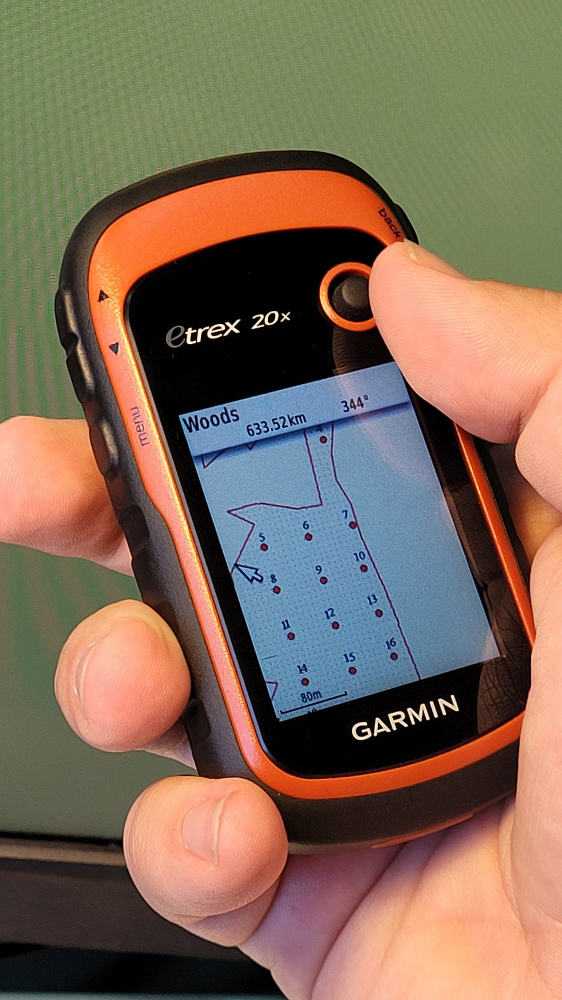

Create forestplots scheme for Garmin
====================================

The tool generates forest field plots in KMZ format ready to upload to Garmin devices. Areas located closer than 10 m from the plot border are discarded. A buffer zone is added around the plot at a distance of 50 m.

Inputs:

*  Input polygon dataset. Supported formats are zipped shapefile, MapInfo TAB or OGR-compatible file. Must contain only one feature without rings.
*  Step between points. Distance between plots in meters. Default 55 meters.

Outputs:

* KMZ file with forest field plots ready to upload to Garmin devices.
* Separate JPG file with forest plots scheme.

Launch the tool: https://toolbox.nextgis.com/t/forestplots_field

   An example of result uploded to Garmin

**Try it out using our sample:**

Download `input dataset <https://nextgis.com/data/toolbox/forestplots_field/forestplots_field_inputs.zip>`_ to test the instrument. Step-by-step instructions included.

Get the `output <https://nextgis.com/data/tolbox/forestplots_field/forestplots_field_outputs.zip>`_ to additionally check the results."

.. admonition:: Related tools

   * `Generate a set of squares with transects <https://toolbox.nextgis.com/t/quadro>`_
   * `Coordinates to polygon <https://toolbox.nextgis.com/t/coords2poly>`_
   * `Geotag photos using GPX track <https://toolbox.nextgis.com/t/gpx2exif>`_
   * `KML to geodata <https://toolbox.nextgis.com/t/kml2geodata>`_