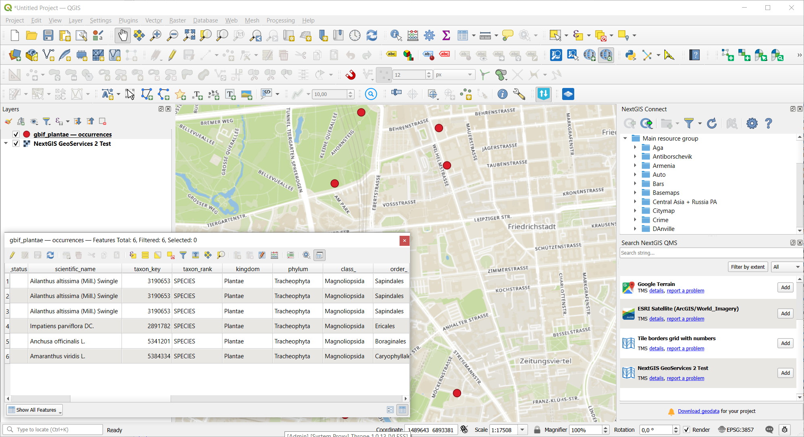

Наблюдения видов GBIF в геоданные
=================================

Запуск инструмента: https://toolbox.nextgis.com/t/gbif_download

Загрузка наблюдений видов из публичного API GBIF для заданной области, с опциональной фильтрацией по таксону (научное название), царству, качеству и дате наблюдения. Ограничение: 10 000 записей за запуск.

На входе:

* Ограничивающий прямоугольник - нарисуйте на карте или введите вручную координаты рамки области интереса (запад, юг, восток, север в WGS84).
* Код страны (ISO 3166-1 alpha-2) - двухбуквенный код страны (например 'DE', 'FR', 'US'). Фильтрует по стране регистрации наблюдения. Комбинируется с 'Ограничивающий прямоугольник' (логическое И).
* Название таксона - научное название таксона (например ``Bubo bubo``). Оставьте пустым, чтобы загрузить все виды.
* Царство. Выберите одно царство (птицы, растения, насекомые, грибы, млекопитающие и т.п.). Комбинируется с 'Название таксона', если оба заданы. Варианты:

    - Animalia
    - Archaea
    - Bacteria
    - Chromista
    - Fungi
    - Plataea
    - Protozoa
    - Viruses

* Тип записи - какие категории записей GBIF включить.
* Дата наблюдения от - нижняя граница даты наблюдения в формате ГГГГ-ММ-ДД.
* Дата наблюдения до - верхняя граница даты наблюдения в формате ГГГГ-ММ-ДД.
* Только дикие - исключить наблюдения в неволе/культуре. По умолчанию: все типы наблюдений.
* Только коммерческие лицензии - ограничить записями с лицензией CC0 или CC-BY (исключает CC-BY-NC). По умолчанию: выключено (все лицензии).
* Исключить записи с проблемами в определении координат - исключить записи, отмеченные GBIF как имеющие проблемы с геопространственными данными (hasGeospatialIssue=false). По умолчанию: включено.

На выходе:

* GeoPackage со слоем точек 'observations';
* Отчёт о работе инструмента;
* Вывод JSON.

Пример работы инструмента:

   Пример результата работы инструмента в QGIS

**Попробуйте инструмент в действии:**

1. Нажмите кнопку **Демо** над формой инструмента. Поля будут автоматически заполнены демонстрационными значениями.
2. Нажмите кнопку **Запустить**.

.. seealso::

   * `Наблюдения видов iNaturalist в геоданные <https://toolbox.nextgis.com/t/inaturalist_download?from-related-tools=1>`_
   * `Скачивание спутниковых данных Sentinel-2 и Landsat-C2L2 <https://toolbox.nextgis.com/t/download_and_prepare_l8_s2?from-related-tools=1>`_
   * `KML в геоданные <https://toolbox.nextgis.com/t/kml2geodata?from-related-tools=1>`_

