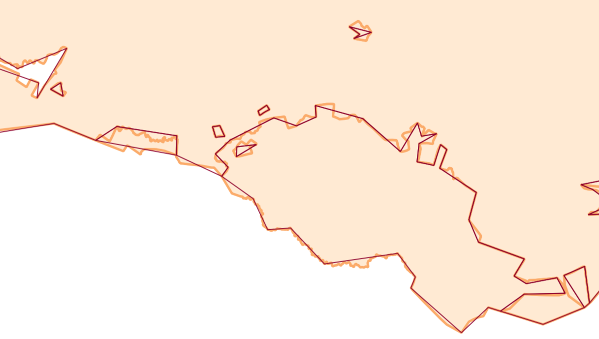

Advanced vector generalization
==============================

Simplification of vector layer features to reduce data volume.

Inputs:

* Vector layer. Layer in GeoPackage, GeoJSON or ESRI Shapefile (ZIP-archived) format
* Merge nodes closer than. The value (in coordinate system units) at which geometry nodes are merged. Default is -1 meaning no merging. Optional
* Number of iterations. An integer indicating the number of iterations of the simplification, smoothing, or shifting procedure. Optional
* Method of generalization. Choose a generalization method: douglas, douglas_reduction, lang, reduction, reumann, boyle, sliding_averaging, distance_weighting, chaiken, hermite, snakes, displacement;
* Max tolerance value (threshold). Number between 0 and 1000000000. If the method does not refer to this parameter, specify any number
* Number of points. An integer that specifies the number of points used in some methods. Optional. The default value is 7
* Reduction. A number from 0 to 100. In the simplification algorithm, it characterizes the percentage of points that are preserved relative to the original number of points. An optional parameter. The default value is 50
* Slide. A number from 0 to 1, characterizes the shift of the obtained point relative to the original. Optional parameter. The default value is 0.5.
* Minimum angle. A number from 0 to 180. Specifies the minimum angle between two consecutive line segments. Optional. The default value is 3
* Alpha. Number, parameter for the Snakes method. Optional. The default value is 1
* Beta. Number, parameter for the Snakes method. Optional. The default value is 1

`More on options for various algorithms <https://grasswiki.osgeo.org/wiki/V.generalize_tutorial>`_

Output:

* GeoPackage file with simplified features (geometries) in a ZIP archive.

Launch the tool: https://toolbox.nextgis.com/t/generalization

Example:

   Light line - input geometries, dark line - output geometries

**Try the tool in action**

1. Click on the **Demo** button above the tool form. The fields are filled in with demo values.
2. Click on the **Run** button.

.. admonition:: Related tools

  * `Polygons topological simplifier <https://toolbox.nextgis.com/t/polysimplifier?from-related-tools=1>`_
  * `Improve DEM <https://toolbox.nextgis.com/t/improvedem?from-related-tools=1>`_
  * `Split Complex Polygons <https://toolbox.nextgis.com/t/splitcomplex?from-related-tools=1>`_
