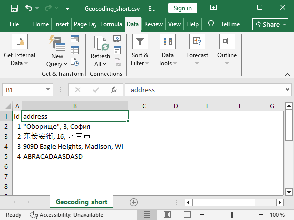
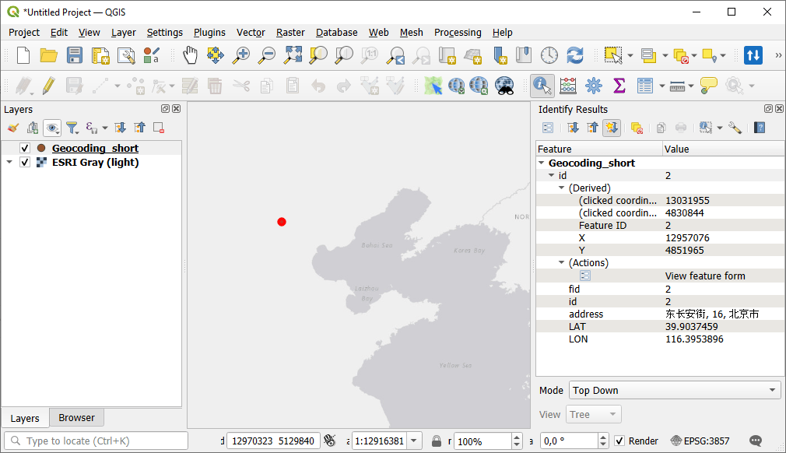

Geocode table
===============

The tool processes addresses from a CSV file and adds its coordinates back to the file. A relevant geocoding license is needed.

Inputs:

* Source file - table file (XLS(X),ODS,CSV,TXT) with a list of addresses. First row should contain field names. File should be in UTF-8 encoding;
* Geocoder - specify one of the available geocoder providers. Note that only Nominatim is free, for others you need a license.
* Address field name in source file;
* API key to run the chosen geocoder. For Nominatim leave empty.

.. note::

   **How to get a geocoder API key**

    Google Geocoding API - https://developers.google.com/maps/documentation/geocoding/usage-and-billing

Outputs:

* ZIP-archive with CSV file, containing two additional columns with latitude and longitude besides original data and GeoPackage containing a point vector layer;
* Report on the number of records: total, processed and non-geocodable.

Launch the tool: https://toolbox.nextgis.com/t/geocodetable

Example:

   Example input

   Example output

**Try the tool in action**

1. Click on the **Demo** button above the tool form. The fields are filled in with demo values.
2. Click on the **Run** button.

.. admonition:: Related tools

  * `Table to vector file <https://toolbox.nextgis.com/t/table2geo?from-related-tools=1>`_
  * `Google Sheets to Web GIS <https://toolbox.nextgis.com/t/spreadsheet2layer?from-related-tools=1>`_
  * `Parse addresses <https://toolbox.nextgis.com/t/postal?from-related-tools=1>`_
  * `Geocode with Nominatim <https://toolbox.nextgis.com/t/nominatim_geocode>`_
