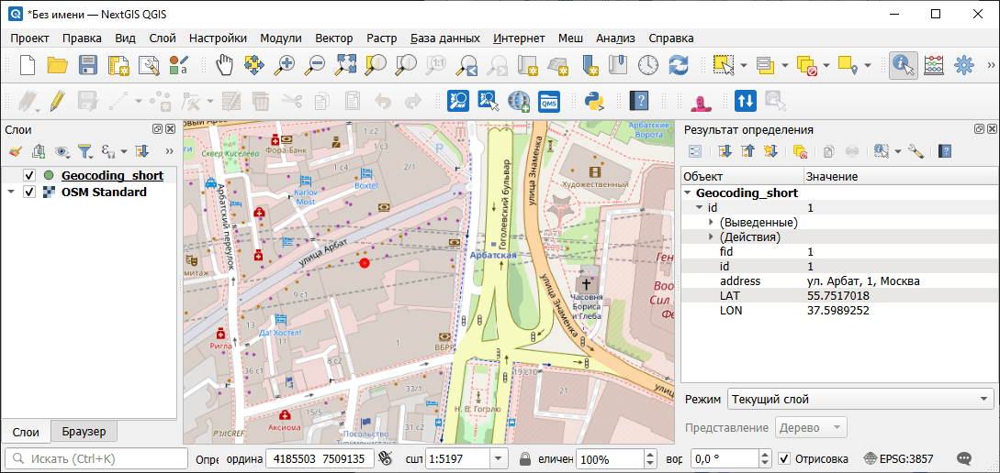

Геокодировать таблицу
=====================

Инструмент распознает адреса в поданном на вход файле CSV и добавляет в файл информацию об их координатах. Необходимо иметь лицензию на использование соответствующего геокодера.

На входе:

*  Исходные данные - Табличный файл (XLS(X),ODS,CSV,TXT) с перечнем адресов. Первая строка должна содержать названия полей (столбцов). Кодировка файла - UTF-8.
* Геокодер. Выберите геокодер (Для использования Google и Yandex нужно иметь соответствующий ключ.):

    - Nominatim (Nominatim)
    - Yandex (Yandex)
    - Google (Google)

* Поле с адресом. Название поля с адресом в исходном файле.
* API ключ. API ключ для запуска выбранного геокодера. Обязателен для всех геокодеров кроме Nominatim.

.. admonition:: Как получить API ключ для геокодера

  Яндекс.Геокодер -  https://developer.tech.yandex.ru/services/ (при создании выберите API ключ **JavaScript API и HTTP Геокодер**)

  Geocoding API от Google - https://developers.google.com/maps/documentation/geocoding/usage-and-billing

На выходе:

* ZIP-архив, внутри которого: CSV, содержащий два дополнительных столбца с координатами (широта и долгота) и файл GeoPackage c точками.
* Отчет: общее количество строк в файле, обработанных строк и пустых строк.

Запуск инструмента: https://toolbox.nextgis.com/t/geocodetable

Пример работы инструмента:

   Пример исходных данных

   Пример результата работы инструмента

Если вы получаете ошибку "Указан некорректный API-ключ либо превышен лимит геокодера":

* Проверьте, не исчерпан ли дневной лимит геокодера в личном кабинете, где вы его получили.
* Убедитесь, что сайт toolbox.nextgis.com не вписан в ограничения геокодера.

**Попробуйте инструмент в действии**

1. Нажмите кнопку **Демо** над формой инструмента. Поля будут автоматически заполнены демонстрационными значениями.
2. Нажмите кнопку **Запустить**.

.. seealso::

    * `Таблица в векторный файл <https://toolbox.nextgis.com/t/table2geo?from-related-tools=1>`_
    * `Таблица Google/Яндекс в Веб ГИС <https://toolbox.nextgis.com/t/spreadsheet2layer?from-related-tools=1>`_
    * `Парсер адреса из CSV <https://toolbox.nextgis.com/t/postal?from-related-tools=1>`_
    * `Генерирует карту в Веб ГИС по таблице со списком кодов регионов ОКАТО и вашим числовым значениям <https://toolbox.nextgis.com/t/infomap?from-related-tools=1>`_
