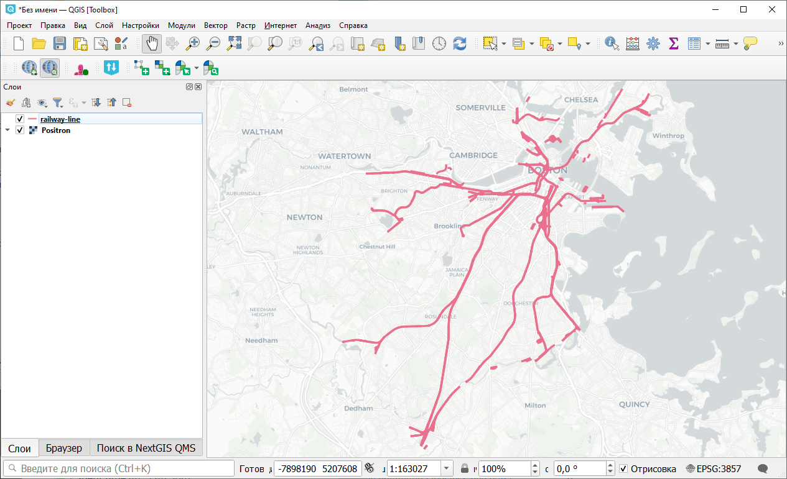
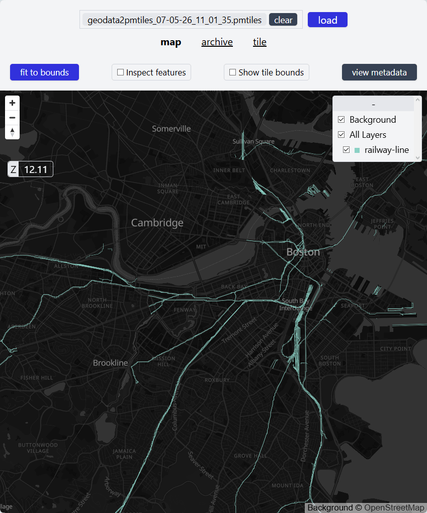

Геоданные в PMTiles
===================

Генерация PMTiles из векторного или растрового источника. PMTiles - открытый формат архивации для хранения пирамид тайлов (векторных или растровых) в одном файле. Он позволяет использовать картографические данные на веб-картах, работая напрямую с облачными хранилищами (S3) через HTTP-запросы.

.. admonition:: Чтобы создать тайлы в других форматах, воспользуйтесь этими инструментами

   * Тайлы, подходящие для NextGIS Mobile `Генерация растровых тайлов из проекта QGIS <https://toolbox.nextgis.com/t/qgis_rastertiles?from-related-tools=1>`_
   * Тайлы для NextGIS Mobile `Создание тайлового набора по растру <https://toolbox.nextgis.com/t/raster2tiles?from-related-tools=1>`_
   * `Генерация векторных тайлов из проекта QGIS <https://toolbox.nextgis.com/t/qgis_vectortiles?from-related-tools=1>`_
   * `Конвертация облака точек в тайлсет <https://toolbox.nextgis.com/t/pointcloud2tileset?from-related-tools=1>`_

На входе:

* Векторный или растровый слой в OGR-совместимом формате;
* Минимальный уровень приближения в диапазоне 0-19;
* Максимальный уровень приближения в диапазоне 0-19.

На выходе:

* Файл в формате PMTiles

Запуск инструмента: https://toolbox.nextgis.com/t/geodata2pmtiles

Пример работы инструмента:

   Пример исходных данных

   Пример результата работы инструмента

**Попробуйте инструмент в действии:**

1. Нажмите кнопку **Демо** над формой инструмента. Поля будут автоматически заполнены демонстрационными значениями.
2. Нажмите кнопку **Запустить**.

