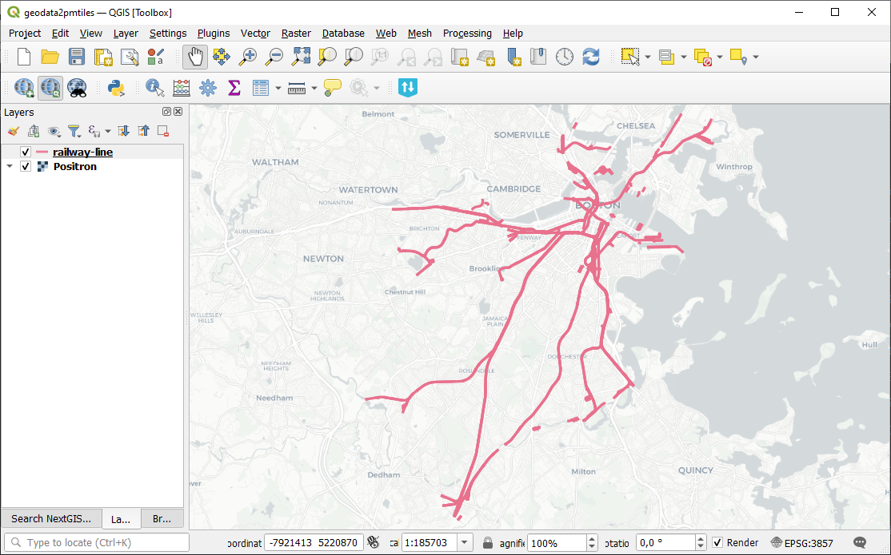

Geodata to PMTiles
==================

Generate PMTiles from vector or raster file. PMTiles is a single-file archive format for tiled data. A PMTiles archive can be hosted on a commodity storage platform such as S3, and used in web applications via HTTP queries.

.. admonition:: To create tiles in other formats, use these tools

  * Tiles suitable for NextGIS Mobile `Generate raster tiles from QGIS project <https://toolbox.nextgis.com/t/qgis_rastertiles?from-related-tools=1>`_
  * Tiles for NextGIS Mobile `Raster to NGRC <https://toolbox.nextgis.com/t/raster2tiles?from-related-tools=1>`_
  * `Generate vector tiles from QGIS project <https://toolbox.nextgis.com/t/qgis_vectortiles?from-related-tools=1>`_
  * `Convert point cloud into tileset <https://toolbox.nextgis.com/t/pointcloud2tileset?from-related-tools=1>`_

Inputs:

* Input file. Vector or raster layer.
* Minimum zoom. 0-19
* Maximum zoom. 0-19

Outputs:

* PMTiles file

Launch the tool: https://toolbox.nextgis.com/t/geodata2pmtiles

Example:

   Example input

.. figure:: _static/geodata2pmtiles_result_en.png
   :name: geodata2pmtiles_result_pic
   :align: center
   :width: 16cm

   Example output

**Try the tool in action**

1. Click on the **Demo** button above the tool form. The fields are filled in with demo values.
2. Click on the **Run** button.