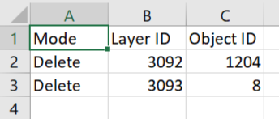

Изменение геометрии в группе слоев
==================================

Инструмент изменяет геометрию объектов в группе слоев ресурса Веб ГИС. Изменение возможно в 3 режимах: Удаление, Вставка, Замена.

Выбор объектов производится на основе заданных значений атрибутивного поля слоя.

В режиме *замены* инструмент заменяет значение геометрии для объектов из загружаемого файла, значения заданного атрибута которых совпадают со значениями атрибута слоя Веб ГИС. Название атрибута в файле и слое Веб ГИС должны совпадать.

В режиме *вставки* инструмент добавляет новые объекты из загружаемого файла, при этом структура файла и слоя должна совпадать. В противном случае, инструмент не сможет добавить новые объекты.

а входе:

* Адрес Веб ГИС. Например: https://sandbox.nextgis.com.
* Логин - NextGIS ID или Имя пользователя,  имеющего права на запись в группу ресурсов.
* Пароль пользователя в Веб ГИС.
* Идентификатор ресурса группы - число, которым заканчивается адрес папки в строке браузера. Для Основной группы ресурсов ID=0;
* Исходное поле - имя исходного поля, по которому производится поиск объектов
* Режим - Тип режима изменения геометрии объектов. Выберите из списка Замениить, Добавить или Удалить;
* Исходное значение - значение поля, по которому осуществляется выбор объектов. Если необходимо указать несколько значений, используйте запятую в качестве разделителя. Параметр необходим в режимах Delete и Change;
* Год начала - начало временного диапазона (опциональный параметр);
* Год окончания - окончание временного диапазона (опциональный параметр);
* Выберите файл SHP - файл в формате ESRI Shapefile (в виде ZIP-архива), который содержит объекты. Загрузка файла необходима в режимах Add и Change.

.. note::
    Год начала и год окончания - необязательные параметры. Данные параметры позволяют ограничить временной диапазон для выбранных слоев. Для использования этих параметров необходимо убедиться, что в названиях слоев ресурса Веб ГИС указаны временные диапазоны. Например, в слое 1245_1246_rus_earl_v.1.0 1245 и 1246 указывают на время. Если данные параметры используются, то необходимо ввести трех- или четырехзначные значения.  Остальные поля являются **обязательными**.

На выходе:

*  CSV файл, в котором представлены данные о выбранном режиме, исходном поле и его значение, перечень гиперссылок на объекты, которые были изменены, в случае возникновения ошибок, они будут также указаны в данном файле.

   Пример результата работы инструмента

Запуск инструмента: https://toolbox.nextgis.com/t/geometry_changer

**Попробуйте инструмент в действии, скачав наш пример:**

`Набор исходных данных <https://nextgis.ru/data/toolbox/geometry_changer/geometry_changer_inputs_ru.zip>`_ для проверки работы инструмента. Внутри архива пошаговая инструкция.

`Пример результата <https://nextgis.ru/data/toolbox/geometry_changer/geometry_changer_outputs_ru.zip>`_ работы инструмента.
