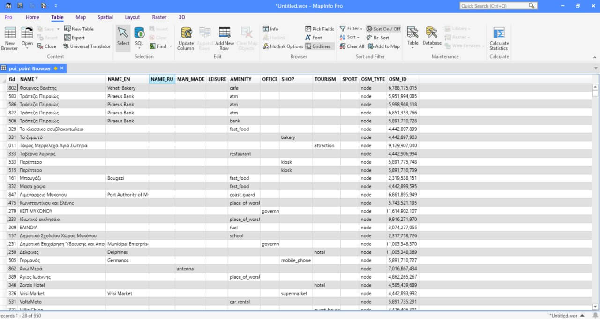

Конвертация GeoPackage в Mapinfo Enhanced TAB
=============================================

Конверация GeoPackage (GPKG) в Enhanced TAB (NativeX), работает в Mapinfo 15.2 и выше. 

Позволяет конвертировать файл GeoPackage с атрибутивной информацией на разных языках в формат MapInfo. Есть поддержка Unicode, благодаря чему при конвертации корректно сохраняются символы алфавитов, отличных от латиницы и кирилицы. Выходной файл имеет кодировку UTF-8.

На входе:

* Один GeoPackage файл, содержащий один слой с векторными геоданными.

На выходе:

* ZIP-архив с полученным Mapinfo Enhanced TAB (NativeX) файлом.

Запуск инструмента: https://toolbox.nextgis.com/t/gpkg2etab

Пример работы инструмента:

   Пример результата работы инструмента

**Попробуйте инструмент в действии, скачав наш пример:**

`Набор исходных данных <https://nextgis.ru/data/toolbox/gpkg2etab/gpkg2etab_inputs_ru.zip>`_ для проверки работы инструмента. Внутри архива пошаговая инструкция.

`Пример результата <https://nextgis.ru/data/toolbox/gpkg2etab/gpkg2etab_outputs_ru.zip>`_ работы инструмента.
