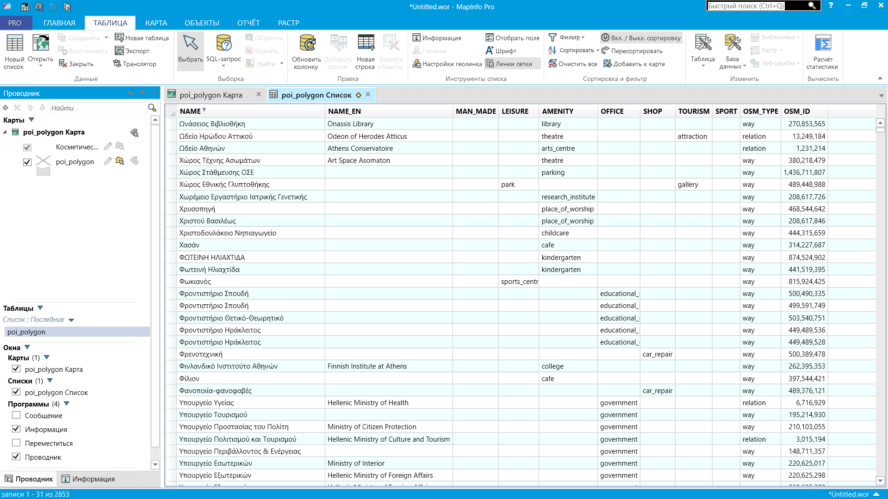

GeoPackage в MapInfo Enhanced TAB
=============================================

Конвертация GeoPackage (GPKG) в Enhanced TAB (NativeX), работает в MapInfo Pro 15.2 и выше. 

Позволяет конвертировать файл GeoPackage с атрибутивной информацией на разных языках в формат MapInfo. Есть поддержка Unicode, благодаря чему при конвертации корректно сохраняются символы алфавитов, отличных от латиницы и кирилицы. Выходной файл имеет кодировку UTF-8.

На входе:

* Один GeoPackage файл, содержащий один слой с векторными геоданными.

На выходе:

* ZIP-архив с полученным MapInfo Enhanced TAB (NativeX) файлом.

Запуск инструмента: https://toolbox.nextgis.com/t/gpkg2etab

Пример работы инструмента:

   Пример результата работы инструмента

**Попробуйте инструмент в действии**

1. Нажмите кнопку **Демо** над формой инструмента. Поля будут автоматически заполнены демонстрационными значениями.
2. Нажмите кнопку **Запустить**.
