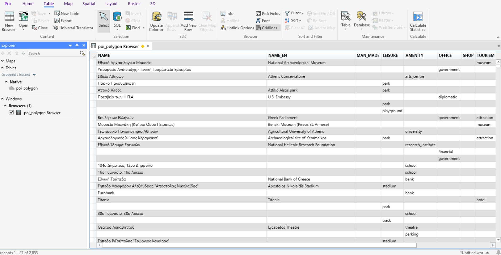

Convert GeoPackage to MapInfo Enhanced TAB
==========================================

Convert GeoPackage (GPKG) to Enhanced TAB (NativeX) for MapInfo Pro 15.2 and above. 

If you have geodata with global coverage containing attribute values in a variety of languages, converting it in GDAL or QGIS may pose problems because Unicode characters are not supported for the format. 

This tool allows you to preserve the correct symbols. The output encoding is UTF-8.

Inputs:

* Single GeoPackage file with one vector layer.

Outputs:

* ZIP archive with MapInfo Enhanced TAB (NativeX) result file.

Launch the tool: https://toolbox.nextgis.com/t/gpkg2etab

Example:

   Example output with Greek names

**Try the tool in action**

1. Click on the **Demo** button above the tool form. The fields are filled in with demo values.
2. Click on the **Run** button.
